# GLM-5.3-Flash on four RTX PRO 6000 Blackwell GPUs: tests of TensorFold and vLLM on one host

Authors: [commdata2338](https://github.com/commdata2338) and [Claude Opus 5.5](https://www.anthropic.com/claude), an AI model of Anthropic. Version 1.5, 5 October 2026.

Each result is from one run on one host, unless the text gives a different number of runs. Tell us if you find an
error.

**Update of 5 October 2026 (version 1.5).** This version adds release r38 of Jovian Judgement. Its tests are from a
sixth session. The results of the other inference stacks did not change.

- The tables of sections 2 to 5 and of section 7 have a row or a column for release r38. Figures 1, 2, 3, and 6
  show it.
- The Summary gives its primary results, and section 5 gives its reuse of a prompt.
- [Appendix C.9](#c9-release-r38-of-jovian-judgement-and-a-control-run-of-release-r24) is new. It compares release
  r38 with a control run of release r24 from the same session, and it gives a probe for short prompts.

## Credits

Other people made the model and the software that this paper tests.

- [TensorFold](https://github.com/ashhart/TensorFold): [ashhart](https://github.com/ashhart).
- [TensorFold recipe](https://github.com/Aevonix/GLM-5.3-Flash-EXL3-4x-RTX-PRO-6000-TensorFold):
  [Aevonix Research](https://github.com/Aevonix), with patches from [Mia's AI Lab](https://github.com/MiaAI-Lab).
- [EXL3 checkpoint](https://huggingface.co/Mia-AiLab/GLM-5.3-Flash-EXL3-4bpw-TensorFold) and
  [sparkDash](https://github.com/MiaAI-Lab/sparkDash): [Mia's AI Lab](https://huggingface.co/Mia-AiLab).
- [DFlash2 drafter](https://huggingface.co/incoai/GLM-5.3-Flash-DFlash2): [incoai](https://huggingface.co/incoai).
- [Jovian Judgement](https://github.com/local-inference-lab/vllm) (the vLLM fork by local-inference-lab), the
  [B12X kernel package](https://github.com/local-inference-lab/b12x), and the
  [NVFP4 checkpoint](https://huggingface.co/local-inference-lab/GLM-5.3-Flash-NVFP4):
  [local-inference-lab](https://github.com/local-inference-lab) and its contributors.
- [vLLM](https://github.com/vllm-project/vllm): the vLLM project. It is the base of Jovian Judgement.
- [GLM-5.3-Flash](https://huggingface.co/zai-org/GLM-5.3-Flash): [Z.ai](https://z.ai).
- [pi](https://github.com/earendil-works/pi), the agent of the quality harness: the pi project.
- [EvalPlus](https://github.com/evalplus/evalplus), HumanEval+, and MBPP+: the EvalPlus team.
  [HumanEval](https://github.com/openai/human-eval) is from OpenAI, and
  [MBPP](https://github.com/google-research/google-research/tree/master/mbpp) is from Google Research.

## Summary

**No inference stack was the fastest for all loads.**

GLM-5.3-Flash is a language model of Z.ai. We did tests of six inference stacks for this model on one workstation
with four RTX PRO 6000 Blackwell GPUs. An inference stack is the software that serves the model. Each inference
stack operated as a server on the same workstation, and only one operated at a time. The tests used the same tools
and the same construction of the prompts.

**What we tested.** An inference stack has three parts.

- **The engine** is the software that loads the model and calculates the tokens. This paper has two engines:
  TensorFold and vLLM.
- **The weights** are the model in a compressed format. TensorFold uses the EXL3 format, and vLLM uses the NVFP4
  format. The two formats are different approximations of the model.
- **The draft method** proposes the subsequent tokens, and the model accepts the tokens that are correct. Accepted
  draft tokens increase the speed.

For each engine, we did tests of two versions: one as its authors published it, and one with changes.

- **TensorFold modified** is the TensorFold recipe with our changes.
- **Jovian Judgement** is the vLLM fork by [local-inference-lab](https://github.com/local-inference-lab). A fork is a copy
  of the source code of a project with changes. The lab uses the name Jovian Judgement for the development branch
  of its fork ([`dev/jovian-judgement`](https://github.com/local-inference-lab/vllm/tree/dev/jovian-judgement)) and
  for its release images. In this paper, the name refers to the three release images that we measured: r24, r28.1,
  and r38.
  It does not refer to the latest code of the branch. With no release number, it is release r24.

| Inference stack | What it is | Made by | Weights | Draft method |
|---|---|---|---|---|
| **TensorFold** | The TensorFold engine in a recipe for four RTX PRO 6000 GPUs. The recipe adds 87 patches to the engine. | Aevonix Research (recipe), ashhart (engine) | EXL3 at 4 bits for each weight | A separate draft model (DFlash2), and copy drafts |
| **TensorFold modified** | TensorFold with our changes: a sampler on the GPU for requests with no top_k, and one prefill for requests that arrive together. | The authors of this paper | The same | The same |
| **Official vLLM** | Release 0.31.0 of the vLLM engine, with no change to its code ([image](https://hub.docker.com/r/vllm/vllm-openai/tags?name=v0.31.0)). It has a default configuration and a tuned configuration in our tests. | The vLLM project | NVFP4 | The MTP head of the model |
| **Jovian Judgement r24** | The vLLM fork by local-inference-lab, release r24 of 4 September 2026 ([image](https://hub.docker.com/r/voipmonitor/vllm/tags?name=jovian-judgement-community-20260904-r24)). It has the [B12X](https://github.com/local-inference-lab/b12x) kernels of the same lab for this GPU type, direct transfers between the GPUs, and draft tokens from the sampler. | local-inference-lab | The same NVFP4 weights | The MTP head of the model |
| **Jovian Judgement r28.1** | A later release of the same fork, of 8 September 2026 ([image](https://hub.docker.com/r/voipmonitor/vllm/tags?name=jovian-judgement-community-20260908-r28.1)). We used it with the settings of release r24. | local-inference-lab | The same NVFP4 weights | The MTP head of the model |
| **Jovian Judgement r38** | A later release of the same fork, of 14 September 2026 ([image](https://hub.docker.com/r/localinferencelab/vllm/tags?name=jovian-judgement-community-20260914-r38)). We used it with the settings of release r24. | local-inference-lab | The same NVFP4 weights | The MTP head of the model |

- **TensorFold and Jovian Judgement** are two recipes that their authors published for this model and this GPU type.
  The comparison of these two recipes is the primary subject of this paper.
- **The official vLLM** uses the same weights as Jovian Judgement. It shows how the fork is different from the
  release of the vLLM project.
- **TensorFold modified** is a test of changes that came from a comparison of the two engines. It shows which
  differences these changes remove.
- **Releases r28.1 and r38** show if a later release of Jovian Judgement changes the results.

Section 1 gives the differences between Jovian Judgement and the official vLLM, and between TensorFold modified
and TensorFold. These are comparisons of recipes. The inference stacks have
different weights, draft methods, kernels, and settings.

**What we found.** Figure 1 shows three loads. The table below it shows the best result for each load.

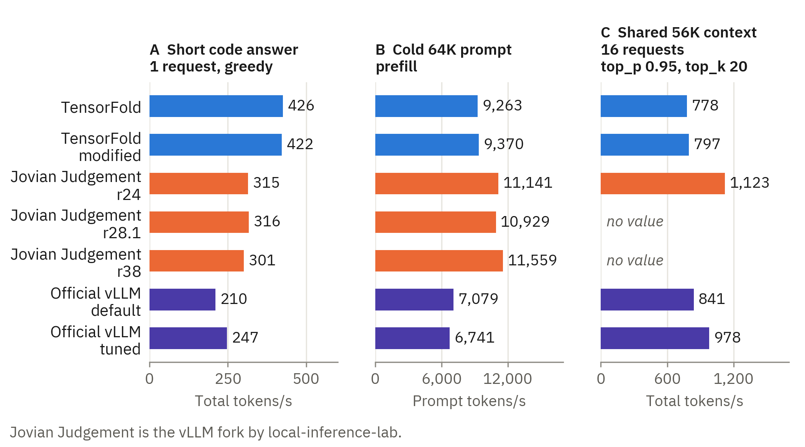

*Figure 1. Three loads on each inference stack. Panel A is the decode test with one greedy code request. Panel B is the
prefill of one cold prompt of 64K tokens. Panel C is the test with a shared context of 56K tokens and 16 requests,
with thinking on, temperature 1, top_p 0.95, and top_k 20. With their default settings, releases r28.1 and r38 of
Jovian Judgement gave no speed in panel C. With one more setting, they gave 1,101 and 1,090 tokens/s (section 4). Sections
2, 3, and 4 give the conditions and the results. TensorFold modified gave the same reply tokens as TensorFold in each
equality test that we did (section 8.2).*

**Which inference stack had the best result for each load in our tests**

| Load | Best result | Section |
|---|---|---|
| Short greedy answers, 1 or 2 concurrent requests | TensorFold and TensorFold modified | 2 |
| Short greedy answers, 16 concurrent requests | No clear difference between TensorFold, TensorFold modified, and Jovian Judgement for prose, code, and JSON. For the count task, TensorFold was 11% faster than Jovian Judgement. | 2 |
| A long prompt that the server reads for the first time | Jovian Judgement, the three releases | 3 |
| A long shared context, 4 to 16 requests with a sampler | Jovian Judgement r24, and releases r28.1 and r38 with the policy `aligned` | 4 |
| A client that sends top_p 1.0 and no top_k | All inference stacks that have this test, but not TensorFold. Releases r28.1 and r38 have this test with the policy `aligned` only. | 4 |
| A client that sends the same prompt again | All inference stacks but Jovian Judgement r24 | 5 |
| A shared context in a user message, with a different question in each request | All inference stacks but Jovian Judgement r28.1 and r38 with their default settings | 5 |
| Four cold requests that arrive together with a shared prefix | Jovian Judgement r28.1 and r38 with the policy `aligned`, and TensorFold modified | 5 |
| An agent with a small context and many short model calls | TensorFold, TensorFold modified, and Jovian Judgement r28.1 and r38, with unequal work | 7 |
| Accuracy of Python tasks through an agent | No difference found | 7 |

This table is for one host and for these tests. It is not a general recommendation. Section 10 gives the limits.

The other primary results are these:

- **Direct GPU links.** With PCIe peer-to-peer transfers on, the prefill speed of Jovian Judgement increased 51% to
  59%. On our host, the IOMMU prevented these transfers until we changed a kernel parameter (section 6).
- **Quality.** Through the pi agent, the inference stacks passed 469 to 479 of 542 Python tasks, and the paired tests found
  no difference. Two runs of Jovian Judgement r24 gave 478 and 475 tasks (section 7).
- **Release r28.1 of Jovian Judgement** had 89% to 106% of the decode speed of release r24 at 1 and at 16 requests
  (section 2). With its default settings, it keeps the cache state at three points of a request only. In the agent
  run, its median model call was 0.87 s, and release r24 had 1.48 s and 1.61 s (sections 5 and 7).
- **Release r38 of Jovian Judgement** showed the reuse of a prompt of release r28.1 (section 5). In the agent run,
  its median model call was 0.84 s (section 7). Release r24 has a control run in the same session. For cold
  prompts of 8K to 64K tokens, the two checkpoint policies of release r38 gave 103% to 108% of its prefill speed.
  Each of these differences is less than 10% (section 3).
- **TensorFold modified** removed two problems of TensorFold and gave the same replies. It was not faster than Jovian
  Judgement with a long shared context (section 9).

## Contents

The body gives the results. The appendixes give the inference stacks, the method, the full tables, and the analysis.
Appendix G explains the B12X kernels of Jovian Judgement in simple words, with diagrams.

- [1. The inference stacks](#1-the-inference-stacks)
- [2. Short greedy answers](#2-short-greedy-answers)
- [3. Prefill of a cold prompt](#3-prefill-of-a-cold-prompt)
- [4. Long shared context and sampler settings](#4-long-shared-context-and-sampler-settings)
- [5. Time to the first token, and reuse of a prompt](#5-time-to-the-first-token-and-reuse-of-a-prompt)
- [6. The direct GPU links](#6-the-direct-gpu-links)
- [7. Quality through an agent](#7-quality-through-an-agent)
- [8. Correctness](#8-correctness)
- [9. TensorFold modified](#9-tensorfold-modified)
- [10. Limits](#10-limits)
- [Appendix A. The inference stacks and the host](#appendix-a-the-inference-stacks-and-the-host): [A.1](#a1-the-two-recipes), [A.2](#a2-the-official-vllm), [A.3](#a3-tensorfold-modified), [A.4](#a4-the-host), [A.5](#a5-direct-gpu-links)
- [Appendix B. Method](#appendix-b-method): [B.1](#b1-tools), [B.2](#b2-how-we-made-the-requests-equal), [B.3](#b3-the-quality-run), [B.4](#b4-the-equality-tests-of-tensorfold-modified), [B.5](#b5-sessions-and-test-sequence), [B.6](#b6-variation-between-runs)
- [Appendix C. Full speed results](#appendix-c-full-speed-results): [C.1](#c1-all-tests-in-one-table), [C.2](#c2-short-greedy-answers), [C.3](#c3-prefill-of-a-cold-prompt), [C.4](#c4-long-shared-context-with-thinking-on), [C.5](#c5-sampler-settings-and-tensorfold), [C.6](#c6-time-to-the-first-token-and-reuse-of-a-prompt), [C.7](#c7-the-direct-gpu-links-and-jovian-judgement), [C.8](#c8-the-two-checkpoint-policies-of-jovian-judgement-r281), [C.9](#c9-release-r38-of-jovian-judgement-and-a-control-run-of-release-r24)
- [Appendix D. Full results of the quality run](#appendix-d-full-results-of-the-quality-run): [D.1](#d1-task-accuracy), [D.2](#d2-the-work-of-the-agent), [D.3](#d3-what-this-result-shows-and-what-it-does-not-show)
- [Appendix E. Why the inference stacks are different, and the changes of TensorFold modified](#appendix-e-why-the-inference-stacks-are-different-and-the-changes-of-tensorfold-modified): [E.1](#e1-jovian-judgement-and-the-official-vllm), [E.2](#e2-tensorfold-the-sampler-the-reuse-the-prefill-and-the-parts-of-a-round), [E.3](#e3-functions-of-jovian-judgement-and-their-equivalents-in-tensorfold), [E.4](#e4-the-changes-of-tensorfold-modified), [E.5](#e5-settings-of-the-release-that-we-measured)
- [Appendix F. Limits, and how to do the tests again](#appendix-f-limits-and-how-to-do-the-tests-again): [F.1](#f1-limits), [F.2](#f2-how-to-do-the-tests-again)
- [Appendix G. B12X in simple words](#appendix-g-b12x-in-simple-words): [G.1](#g1-what-b12x-is), [G.2](#g2-the-two-types-of-work), [G.3](#g3-three-ideas-that-can-make-a-kernel-faster), [G.4](#g4-what-our-tests-show), [G.5](#g5-the-costs), [G.6](#g6-when-b12x-is-a-good-selection)
- [License](#license)
- [About the text](#about-the-text)

## 1. The inference stacks

**The two TensorFold inference stacks use EXL3 weights at 4 bits. Jovian Judgement and the official vLLM use the same NVFP4
weights.**

**The two engines.** TensorFold and vLLM are different programs. TensorFold operates with four ranks, one for each
GPU. vLLM operates with tensor parallel 4. Thus each engine divides the model between the four GPUs.

**Jovian Judgement and the official vLLM.** Jovian Judgement is the vLLM fork by local-inference-lab. Release r24
started from the source code of vLLM of 25 August 2026, and it has 220 more commits. Its image also contains
[B12X](https://github.com/local-inference-lab/b12x), the kernel package of the same lab. The vLLM project changed its code after
that date, and release 0.31.0 has its own support for GLM-5.3. Thus Jovian Judgement is not release 0.31.0 with
changes. The two inference stacks have the same base and different later changes. The table shows the primary differences.
Appendix E.1 gives all the differences that we found. Appendix G explains B12X in simple words.

| Function | Jovian Judgement r24 | Official vLLM 0.31.0 |
|---|---|---|
| Kernels for the NVFP4 experts | B12X, from the `b12x` package | FlashInfer CUTLASS |
| Kernel for the sparse attention | B12X | FlashInfer |
| All-reduce between the GPUs | B12X PCIe all-reduce, in decode and in prefill | NCCL by default. A FlashInfer PCIe all-reduce is an option, for a maximum of 256 tokens. |
| Draft tokens from the sampler | Yes, with the top_k and top_p limits of the request | The default is greedy draft tokens |
| Scheduler that divides the compute time between prefill and decode | Yes | Not available |
| Cache entry for a prompt that a client sends a second time, with MTP | No | Yes |
| KV cache with 16 slots and a memory fraction of 0.90 | 2.68M tokens | 3.38M tokens |

**The three releases of Jovian Judgement.** Release r24 is the image of 4 September 2026, and it is the release of
our comparison with TensorFold. Release r28.1 is the image of 8 September 2026. Its source code has 155 commits that
release r24 does not have, and release r24 has 91 commits that release r28.1 does not have. Release r38 is the image
of 14 September 2026. Its source code has 262 commits that release r24 does not have, and release r24 has 84 commits
that release r38 does not have. We used releases r28.1 and r38 with the settings and the weights of release r24.
The largest difference that we found is the rule for the reuse of a prompt (section 5).

**TensorFold modified and TensorFold.** TensorFold modified is the TensorFold of the recipe with our changes. The
weights, the draft model, and the other settings are the same. Each change has a setting, and each setting is off by
default. Appendix A.3 gives the settings, and Appendix E.4 gives each change.

| Function | TensorFold | TensorFold modified |
|---|---|---|
| Sampler for a request with a top_k value | On the GPU | The same |
| Sampler for a request with no top_k | On the CPU | On the GPU. A row with a result that is not certain uses the CPU rule. |
| A request with top_p 1.0 and no top_k | Each rank sends its full part of the vocabulary to the CPU | Each rank finds its best token on the GPU |
| Requests that arrive together with a shared prefix | Each request does the prefill of the shared part | One request does the prefill, and the other requests copy the engine state |
| The cause of each cache decision | Not in the log | In the log |
| Transport for the all-gathers between the ranks | NCCL | CUDA IPC. The release engine contains this transport. |
| Replies | The reference | The same tokens in each equality test (section 8.2) |

**The configurations in the tests.**

| Configuration | Weights | Draft tokens | Slots | Chat template | KV cache | Sessions |
|---|---|---|---:|---|---|---|
| TensorFold | EXL3 at 4 bits, FP8 dense layers | DFlash2 and copy drafts | 40 | the renderer of TensorFold | one pool of 5.10M tokens | 1, 3, 4 |
| TensorFold modified | the same | the same | 40 | the same | one pool of 5.09M tokens | 4 |
| Jovian Judgement r24, speed tests | NVFP4 | MTP at depth 3, from the sampler | 16 | with the thinking switch | 2.68M tokens (memory fraction 0.90) | 1, 3, 6 |
| Jovian Judgement r24, usual configuration | NVFP4 | the same | 8 | standard | 3.47M tokens (memory fraction 0.93) | 1 (section 6), 4 and 5 (section 7) |
| Jovian Judgement r28.1, speed tests | NVFP4 | the same | 16 | with the thinking switch | 2.56M to 2.58M tokens (memory fraction 0.90) | 5 |
| Jovian Judgement r28.1, usual configuration | NVFP4 | the same | 8 | standard | 3.37M tokens (memory fraction 0.93) | 5 (section 7) |
| Jovian Judgement r38, speed tests | NVFP4 | the same | 16 | with the thinking switch | 2.69M tokens (memory fraction 0.90) | 6 |
| Jovian Judgement r38, usual configuration | NVFP4 | the same | 8 | standard | 3.38M tokens (memory fraction 0.93) | 6 (section 7) |
| Official vLLM, default | NVFP4 | MTP at depth 3, greedy | 16 | with the thinking switch | 3.38M tokens (memory fraction 0.90) | 2, 5 |
| Official vLLM, tuned | NVFP4 | MTP at depth 3, from the sampler | 16 | with the thinking switch | memory fraction 0.90 | 2, 5 |

The context limit was 1,048,576 tokens on the two TensorFold inference stacks and 524,288 tokens on the vLLM inference stacks. No test
used more than 262K tokens. Appendix B.5 gives the sessions.

- **The host** has four NVIDIA RTX PRO 6000 Blackwell GPUs with 96 GB, and a power limit of 250 W for each GPU. Each
  GPU is in a PCIe 5.0 x16 slot that connects directly to the CPU. There is no NVLink (Appendix A.4).
- **The official vLLM did not start with the settings of Jovian Judgement.** Three changes were necessary
  (Appendix A.2). Releases r28.1 and r38 of Jovian Judgement started with the settings of release r24.
- **The changes of TensorFold modified** are in the file
  [`patches/tensorfold-modified-engine.patch`](patches/tensorfold-modified-engine.patch).

Appendix A gives the recipes and the host. Appendix B gives the method.

## 2. Short greedy answers

**At one request, TensorFold was 35% faster than Jovian Judgement for code. At 16 requests, the difference was 4% or
less for prose, code, and JSON.**

The decode test of sparkDash sends greedy requests with thinking off. Each stream writes 400 tokens. The test has
four prompt types, and 1 to 16 concurrent requests.

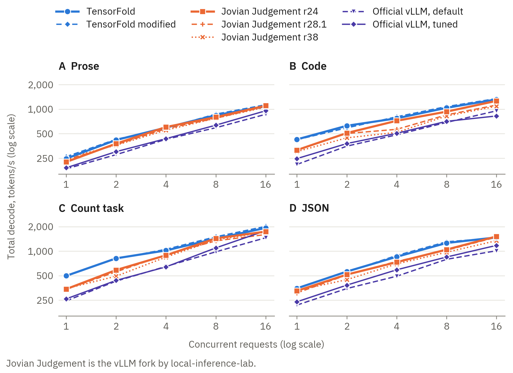

*Figure 2. Decode test of sparkDash: greedy, thinking off, 400 tokens for each stream. The two axes are
logarithmic. Thus an equal distance between two lines is an equal ratio of their speeds. For the official vLLM, the
figure shows the second of two runs.*

| Inference stack | Prose, 1 | Prose, 16 | Code, 1 | Code, 16 | Count task, 1 | Count task, 16 | JSON, 1 | JSON, 16 |
|---|---:|---:|---:|---:|---:|---:|---:|---:|
| TensorFold | 247 | 1,091 | 426 | 1,319 | 498 | 1,930 | 349 | 1,475 |
| TensorFold modified | 261 | 1,134 | 422 | 1,350 | 500 | 2,015 | 352 | 1,457 |
| Jovian Judgement r24 | 225 | 1,105 | 315 | 1,265 | 342 | 1,739 | 325 | 1,516 |
| Jovian Judgement r28.1 | 239 | 1,079 | 316 | 1,123 | 340 | 1,600 | 307 | 1,486 |
| Jovian Judgement r38 | 250 | 1,059 | 301 | 1,088 | 347 | 1,715 | 329 | 1,344 |
| Official vLLM, default | 185 | 866 | 210 | 955 | 245 | 1,461 | 218 | 1,011 |
| Official vLLM, tuned | 191 | 958 | 247 | 826 | 259 | 1,785 | 239 | 1,177 |

The table shows the total tokens/s at 1 and at 16 concurrent requests. Each row is one run. At 16 requests, the
difference of 4% or less for prose, code, and JSON is less than the variation between runs (Appendix B.6). For the
count task, TensorFold was 11% faster.

Appendix C.2 gives each comparison, the results for 2, 4, and 8 requests, the published values, and the two runs
of the official vLLM. It also gives a second greedy test with a context of 1K tokens.

## 3. Prefill of a cold prompt

**In the prefill of a cold prompt, Jovian Judgement was 12% to 30% faster than TensorFold.**

The prefill test of sparkDash sends one cold prompt of 8K to 256K tokens. The speed is the prompt tokens divided by
the time to the first token.

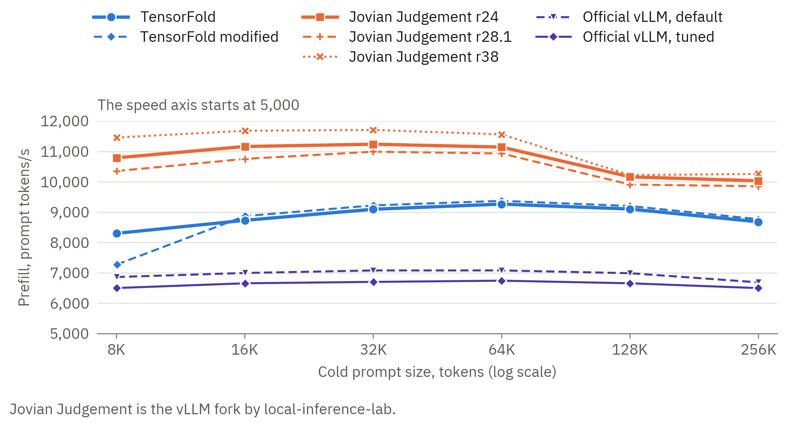

*Figure 3. Prefill test of sparkDash with one cold prompt. The speed axis starts at 5,000 tokens/s. For the
official vLLM, the figure shows the second of two runs.*

| Inference stack | 8K | 64K | 256K |
|---|---:|---:|---:|
| TensorFold | 8,300 | 9,263 | 8,679 |
| TensorFold modified | 7,274 | 9,370 | 8,766 |
| Jovian Judgement r24 | 10,787 | 11,141 | 10,030 |
| Jovian Judgement r28.1 | 10,353 | 10,929 | 9,850 |
| Jovian Judgement r38 | 11,455 | 11,559 | 10,258 |
| Official vLLM, default | 6,862 | 7,079 | 6,686 |
| Official vLLM, tuned | 6,500 | 6,741 | 6,496 |

The table shows the prompt tokens/s for three prompt sizes. Each row is one run. The official vLLM in its default
configuration had a prefill speed near to the speed of Jovian Judgement with the direct GPU links off (section 6).
The row of release r24 is from session 1. In the session of release r38, release r24 has a control run. For prompts
of 8K to 64K tokens, release r38 gave 104% to 108% of the speed of that run. With the policy `aligned`, it gave
103% to 105%. Each cell is one run, and each of these differences is less than 10% (Appendix C.9).

Appendix C.3 gives each comparison, the six prompt sizes, the values that the TensorFold recipe publishes, and
Jovian Judgement with the links off.

## 4. Long shared context and sampler settings

**With a shared context of 56K tokens, top_p 0.95, and top_k 20, Jovian Judgement was 1.2 to 1.4 times faster than
TensorFold. With top_p 0.95 and no top_k, it was 1.7 to 2.4 times faster.**

This test has the shape of an agent load. C requests start at the same time. Each request contains the same 56K
tokens of source code and a different short question. Each request writes 2,000 tokens at temperature 1, with
thinking at effort max. We did the test with three groups of sampler settings.

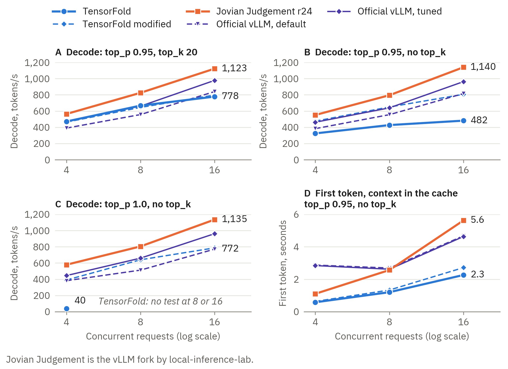

*Figure 4. Shared context of 56K tokens, thinking on, temperature 1, 2,000 tokens for each stream. Panels A to C
show the total decode speed for three groups of sampler settings. Panel D shows the median time to the first token
with the context in the cache. A point is the mean of two runs where Appendix C.4 gives two runs, and one run in
the other cells. The labels show the highest value and the lowest value at 16 requests. The figure does not show
releases r28.1 and r38 of Jovian Judgement. The table gives their results.*

| Requests | Inference stack | top_p 0.95, top_k 20 | top_p 0.95, no top_k | top_p 1.0, no top_k | Time to first token, s |
|---:|---|---:|---:|---:|---:|
| 4 | TensorFold | 471 | 325 | 40 | 0.6 |
|  | TensorFold modified | 464 | 475 | 391 | 0.6 |
|  | Jovian Judgement r24 | 564 | 551 | 579 | 1.1 |
|  | Jovian Judgement r28.1 | no value | no value | no test | 24.0 |
|  | Jovian Judgement r28.1, policy aligned | 579 | 570 | 562 | 1.1 |
|  | Jovian Judgement r38 | no value | no test | no test | no test |
|  | Jovian Judgement r38, policy aligned | 570 | 573 | 562 | 1.0 |
|  | Official vLLM, default | 390 | 383 | 382 | 2.9 |
|  | Official vLLM, tuned | 473 | 463 | 445 | 2.8 |
| 8 | TensorFold | 667 | 427 | no test | 1.2 |
|  | TensorFold modified | 645 | 650 | 640 | 1.3 |
|  | Jovian Judgement r24 | 825 | 795 | 805 | 2.6 |
|  | Jovian Judgement r28.1 | no value | no value | no test | 49.9 |
|  | Jovian Judgement r28.1, policy aligned | 822 | 798 | 795 | 2.6 |
|  | Jovian Judgement r38 | no value | no test | no test | no test |
|  | Jovian Judgement r38, policy aligned | 804 | 799 | 799 | 2.5 |
|  | Official vLLM, default | 557 | 556 | 513 | 2.7 |
|  | Official vLLM, tuned | 660 | 640 | 660 | 2.6 |
| 16 | TensorFold | 778 | 482 | no test | 2.3 |
|  | TensorFold modified | 797 | 806 | 787 | 2.7 |
|  | Jovian Judgement r24 | 1,123 | 1,140 | 1,135 | 5.6 |
|  | Jovian Judgement r28.1 | no value | no value | no test | 100.7 |
|  | Jovian Judgement r28.1, policy aligned | 1,101 | 1,085 | 1,092 | 5.6 |
|  | Jovian Judgement r38 | no value | no test | no test | no test |
|  | Jovian Judgement r38, policy aligned | 1,090 | 1,068 | 1,054 | 5.6 |
|  | Official vLLM, default | 841 | 816 | 772 | 4.7 |
|  | Official vLLM, tuned | 978 | 963 | 962 | 4.6 |

The table shows the total tokens/s, and the median time to the first token of the requests. That time is from the
test with top_p 0.95 and no top_k. Each request found the shared context in the cache, but not on Jovian Judgement
r28.1 and r38 with their default settings. "No value" is a test that gave no speed: no time interval contained the
output of all requests.

- **The sampler of TensorFold.** With a top_k value, TensorFold uses its GPU sampler. With no top_k, it makes
  each sampler decision on the CPU. Top_k 20 is its default.
- **With top_p 1.0 and no top_k,** TensorFold gave a total of 40 tokens/s for four streams. The server defaults
  of TensorFold are top_p 0.95 and top_k 20. Thus a client that sends no sampler settings does not get this
  decrease. A client that sends top_p 1.0 and no top_k gets it.
- **Jovian Judgement r28.1 and r38 with their default settings** did the prefill of the 56K context again for each
  request. Section 5 gives the cause. Release r38 has one run of this test, with top_p 0.95 and top_k 20. Its median
  time to the first token was 24 s, 46 s, and 95 s at 4, 8, and 16 requests.
- **The token count** of the two TensorFold inference stacks is an estimate in this test. Appendix B.1 gives a
  check of the estimate. The check does not measure its error.

Appendix C.4 gives each comparison, the cells with two runs, the cache state, and the time for a decode round. Appendix C.5 gives
the test of six groups of sampler settings on TensorFold, with a context of 1K tokens.

## 5. Time to the first token, and reuse of a prompt

**The inference stacks did not use their cache for the same types of prompt. Jovian Judgement r24 did the prefill again for
a prompt that a client sent a second time. With their default settings, releases r28.1 and r38 did the prefill again
for a shared context in a user message with a different question.**

The table shows the seconds to the first token for a chat of 83.6K tokens. Each cell shows two runs. The three
releases of Jovian Judgement had 16 slots in this test.

| Inference stack | Cold | Same prompt again | Same prompt and a new turn | Answer of the model and a new turn |
|---|---:|---:|---:|---:|
| TensorFold | 10.3, 10.3 | 0.16, 0.02 | 0.37, 10.4 | 0.32, 0.29 |
| TensorFold modified | 10.2, 10.2 | 0.18, 0.02 | 0.39, 10.4 | 0.34, 0.28 |
| Jovian Judgement r24 | 8.0, 8.0 | 7.9, 7.9 | 0.56, 0.56 | 0.57, 0.56 |
| Jovian Judgement r28.1 | 8.3, 8.1 | 0.14, 0.13 | 8.2, 8.2 | 0.42, 0.42 |
| Jovian Judgement r28.1, policy aligned | 8.1, 8.1 | 0.49, 0.47 | 0.58, 0.57 | 0.58, 0.57 |
| Jovian Judgement r38 | 7.8, 7.6 | 0.14, 0.14 | 7.9, 7.7 | 0.32, 0.33 |
| Jovian Judgement r38, policy aligned | 7.6, 7.6 | 0.55, 0.54 | 0.72, 0.68 | 0.74, 0.72 |
| Official vLLM, default | 12.3, 12.2 | 0.54, 0.56 | 0.66, 0.69 | 0.70, 0.69 |
| Official vLLM, tuned | 12.1, 12.3 | 0.54, 0.56 | 0.69, 0.68 | 0.69, 0.70 |

- **The same prompt again.** With MTP draft tokens, release r24 finds no cache entry for a prompt that stops at
  the same point as an earlier prompt.
- **The answer of the model and a new turn** is the usual sequence of a conversation. Each inference stack used
  its cache.
- **The same prompt and a new turn, with no answer between.** The long times of TensorFold and TensorFold
  modified come from the shape of our probe and a grid of 64 tokens (Appendix C.6). The long times of releases
  r28.1 and r38 come from their rule for the cache state (see below).

**A shared context with a different question.** A second check sends one request at a time. Each request is one
user message with the same context of 56K tokens and a short question. The table shows the seconds to the full
reply of 16 tokens. A step that used as much time as step 1 did the prefill of the context again.

| Step | Jovian Judgement r24, 8 slots | Jovian Judgement r28.1, 16 slots | Jovian Judgement r28.1, policy aligned, 16 slots | Jovian Judgement r38, 16 slots | Jovian Judgement r38, policy aligned, 16 slots | Official vLLM, default, 16 slots |
|---|---:|---:|---:|---:|---:|---:|
| 1. A context of 56K tokens and a question | 5.42 | 5.30 | 5.25 | 7.67 | 5.03 | 9.20 |
| 2. The same request again | 5.21 | 0.28 | 0.50 | 0.28 | 0.58 | 0.65 |
| 3. The same context and a different question | 0.47 | 5.32 | 0.47 | 4.89 | 0.55 | 0.70 |
| 4. The request of step 1, with 300 output tokens | 1.54 | 1.25 | 1.51 | 1.25 | 1.54 | 2.22 |
| 5. The request of step 1 again | 0.45 | 0.16 | 0.45 | 0.19 | 0.44 | 0.64 |
| 6. The same context and a third question | 0.45 | 5.31 | 0.47 | 4.93 | 0.44 | 0.66 |

- **Releases r28.1 and r38 did the prefill again for each different question (steps 3 and 6).** The cause is a
  setting of these releases, `--recurrent-checkpoint-policy`. With the default of this
  setting, the server keeps the state of the linear attention at three points of a request only. The first point
  is the end of a system message at the start of the prompt. The other points are the end of the prompt and the end
  of the reply. The start log of the server shows this rule. Release r24 does not have this setting. It keeps a
  state at block limits of 2,048 tokens.
- **With the context in a system message,** releases r28.1 and r38 used their cache for a different question. The
  reply came after 0.27 s and 0.42 s (Appendix C.6). Thus an agent with a long system message gets the reuse with
  the default settings. A client that puts a shared document in the user message does not get it.
- **With `--recurrent-checkpoint-policy aligned`,** releases r28.1 and r38 used their cache in each case of the two
  tables after the first prompt.

**Requests that arrive together.** Four cold requests with a shared prefix of 42K tokens started at the same time.
Each request had temperature 1, top_p 0.95, top_k 20, and 128 output tokens. The table shows the time to the first
token of the four requests. The three releases of Jovian Judgement had 8 slots in this test. Releases r28.1 and r38
with the policy `aligned` had 16 slots.

| Inference stack | Time to the first token of each of the four requests, s |
|---|---:|
| TensorFold | 9.0, 14.4, 18.6, 21.8 |
| TensorFold modified | 5.5, 5.5, 5.5, 5.5 |
| Jovian Judgement r24 | 4.4, 8.4, 8.4, 8.8 |
| Jovian Judgement r28.1 | 4.5, 9.3, 12.7, 16.5 |
| Jovian Judgement r28.1, policy aligned | 4.8, 4.8, 4.8, 5.1 |
| Jovian Judgement r38 | 4.7, 9.4, 13.8, 17.0 |
| Jovian Judgement r38, policy aligned | 4.5, 4.5, 4.5, 4.9 |
| Official vLLM, default | 8.8, 13.7, 14.2, 14.7 |
| Official vLLM, tuned | 9.1, 14.2, 14.7, 15.1 |

- **TensorFold** did the prefill of the shared part for each request. **TensorFold modified** did it one time, and
  the replies had the same token ids on the two inference stacks. For this test, TensorFold modified had the three sampler
  settings and burst reuse on, and CUDA IPC off.
- **Jovian Judgement r28.1 and r38 with their default settings** did the prefill of the full prompt for each
  request. With the policy `aligned`, the four requests got their first token after one prefill.

Appendix C.6 gives the results for a chat of 13.5K tokens and each request of the test with four cold requests. It
also gives the check with the context in a system message and the first wave of the long-context test. It gives
the causes of the cache misses on TensorFold. Appendix C.8 compares the two settings of release r28.1, and
Appendix C.9 gives release r38.

## 6. The direct GPU links

**With the direct GPU links on, the prefill speed of Jovian Judgement increased 51% to 59%.**

The engines use PCIe peer-to-peer transfers between the GPUs. This paper names them the direct GPU links. On our
host, the IOMMU prevented these transfers until we started the kernel with `iommu=pt`. TensorFold did not start
without them.

We measured Jovian Judgement with the links off and then with the links on. The server had its usual 8 slots, and the
two measurements were in the same boot of the host. The change is the effect of two settings together
(Appendix C.7).

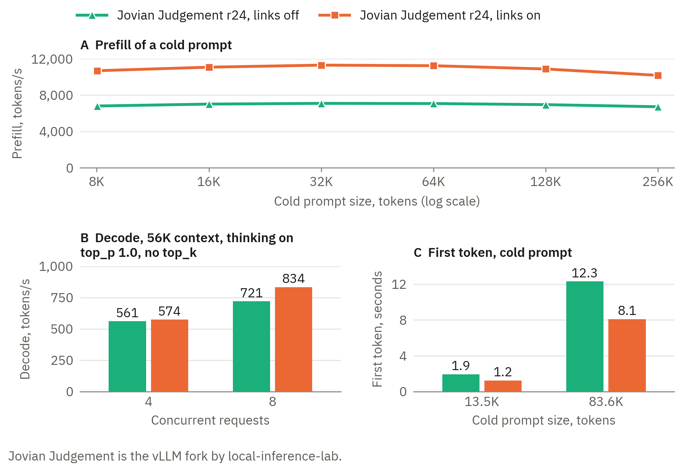

*Figure 5. Jovian Judgement with 8 slots in the same boot, with the direct GPU links off and on.*

|  | Links off | Links on | Change |
|---|---:|---:|---:|
| Prefill of a cold prompt, 8K to 256K, tokens/s | 6,718 to 7,090 | 10,173 to 11,299 | +51% to +59% |
| Time to first token, cold chat of 83.6K tokens, s | 12.3 | 8.1 | −34% |
| Time to first token, new turn on a chat of 83.6K tokens, s | 0.81 | 0.57 | −30% |
| Decode, 56K context, thinking on, top_p 1.0, no top_k, 8 requests, tokens/s | 721 | 834 | +16% |
| Decode, 56K context, thinking on, top_p 1.0, no top_k, 4 requests, tokens/s | 561 | 574 | +2% |

- **Prefill shows the largest increase.** A possible cause is that prefill moves the most data between the GPUs for
  each step.
- **The application gets no error when the IOMMU prevents a transfer.** Appendix A.5 gives the cause, a diagram,
  and the correction. We recommend that you do the copy test of that appendix before you use one of the recipes.

## 7. Quality through an agent

**Through the pi agent, the inference stacks passed 469 to 479 of 542 Python tasks. The paired
tests found no difference. Two runs of Jovian Judgement r24 gave 478 and 475 tasks.**

The two recipes use different approximations of the model. Thus equal speed does not show equal answers. The agent
is [pi](https://github.com/earendil-works/pi) 0.86.1. It did the 542 Python tasks of EvalPlus (HumanEval+ and MBPP+)
on six inference stacks. Each task got one attempt, with temperature 0 and thinking at effort max. Jovian Judgement r24 has
two runs. The official vLLM was in its default configuration. Appendix B.3 gives the method.

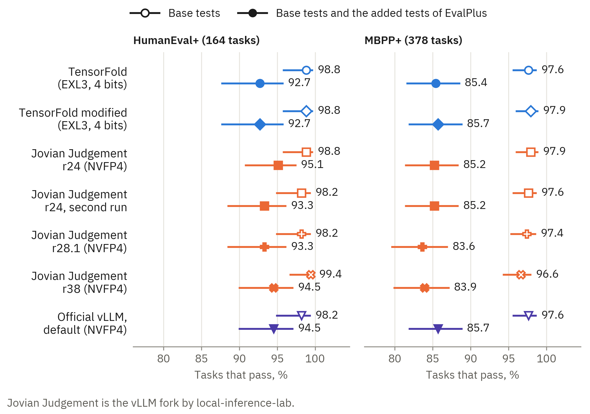

*Figure 6. The tasks that pass, with the 95% Wilson interval. Each point is one run of the pi agent on one inference stack,
with one attempt for each task.*

| Tasks that pass all tests | TensorFold | TensorFold modified | Jovian Judgement r24 | Jovian Judgement r24, second run | Jovian Judgement r28.1 | Jovian Judgement r38 | Official vLLM, default |
|---|---:|---:|---:|---:|---:|---:|---:|
| HumanEval+, 164 tasks | 152 (92.7%) | 152 (92.7%) | 156 (95.1%) | 153 (93.3%) | 153 (93.3%) | 155 (94.5%) | 155 (94.5%) |
| MBPP+, 378 tasks | 323 (85.4%) | 324 (85.7%) | 322 (85.2%) | 322 (85.2%) | 316 (83.6%) | 317 (83.9%) | 324 (85.7%) |
| The two data sets, 542 tasks | 475 (87.6%) | 476 (87.8%) | 478 (88.2%) | 475 (87.6%) | 469 (86.5%) | 472 (87.1%) | 479 (88.4%) |

The paired comparison shows the tasks that have a different result on two inference stacks. The difference is the pass rate
of the second inference stack minus the pass rate of the first inference stack.

| Pair | Only the first passes | Only the second passes | Second minus first, percentage points (95% interval) | Exact McNemar test, p |
|---|---:|---:|---:|---:|
| TensorFold and TensorFold modified | 1 | 2 | +0.2 (−0.4 to +0.8) | 1.00 |
| TensorFold and Jovian Judgement r24 | 13 | 16 | +0.6 (−1.4 to +2.5) | 0.71 |
| Jovian Judgement r24, the first run and the second run | 16 | 13 | −0.6 (−2.5 to +1.4) | 0.71 |
| Jovian Judgement r24 and Jovian Judgement r28.1 | 18 | 9 | −1.7 (−3.5 to +0.2) | 0.12 |
| Jovian Judgement r24 and Jovian Judgement r38 | 19 | 13 | −1.1 (−3.2 to +0.9) | 0.38 |
| Jovian Judgement r24 and the official vLLM, default | 15 | 16 | +0.2 (−1.8 to +2.2) | 1.00 |

- **We found no difference in accuracy between the inference stacks.**
- **Two runs of one inference stack were as different as two inference stacks.** The two runs of Jovian
  Judgement r24 had a different result for 29 tasks. TensorFold and Jovian Judgement r24 also had a different
  result for 29 tasks.
- **This result does not show that the inference stacks are equal.** The 95% interval of the difference between TensorFold
  and Jovian Judgement is −1.4 to +2.5 percentage points.
- **Do not compare these scores with scores from single requests.** The agent can run its code, read the errors,
  and write the file again.

The inference stacks did different work for the same tasks.

|  | TensorFold | TensorFold modified | Jovian Judgement r24 | Jovian Judgement r24, second run | Jovian Judgement r28.1 | Jovian Judgement r38 | Official vLLM, default |
|---|---:|---:|---:|---:|---:|---:|---:|
| Model calls | 2,568 | 2,567 | 2,361 | 2,343 | 2,394 | 2,357 | 2,492 |
| Output tokens, thoughts included | 621K | 617K | 889K | 774K | 797K | 919K | 808K |
| Median time for a model call, s | 0.88 | 0.80 | 1.48 | 1.61 | 0.87 | 0.84 | 1.63 |

- **A model call was shorter on releases r28.1 and r38 than on release r24.** A possible cause is the cache state
  that these releases keep at the end of each reply (section 5).
- **This table is not a speed test with equal work.**

Appendix D gives the base tests, the full paired counts, the work of the agent, and the tasks that did not
complete.

## 8. Correctness

**TensorFold modified gave the same reply tokens as TensorFold in each equality test that we did.**

### 8.1 A passphrase in a long prompt

This test is a small check that a server reads a long prompt correctly. A passphrase in the answer or in the
thoughts is a correct result. Each run of the probe makes new filler text and a new passphrase.

TensorFold and Jovian Judgement gave the correct passphrase at approximately 2K, 30K, and 200K tokens. In the 200K
case, the answer of TensorFold started with "The passphrase is quartz-83547-prism.</think>quartz…". With thinking
off, the model wrote a thought and then closed the think block a second time. The template of GLM-5.3 does not make
the prompt form that TensorFold uses for thinking off.

The official vLLM gave the correct passphrase at approximately 2K and 30K tokens. In the 200K case, the answer
started with a sentence about the task. The limit of 40 tokens stopped the answer before the passphrase. We sent two
new 200K prompts to each configuration, with a limit of 300 tokens. Each answer contained the correct passphrase and
had 47 to 98 tokens. These prompts were not the same text as the first prompt.

On each inference stack, the thinking-off probe showed the same prompt token counts and the same speeds for its two forms
(Appendix B.2). We did not do the passphrase test on TensorFold modified.

### 8.2 The replies of TensorFold modified

Appendix B.4 gives the four equality tests. TensorFold modified gave the same replies as TensorFold in each test.
These tests show equal replies for these requests. They do not show equal replies for each possible request.

| Test | Result |
|---|---|
| Synthetic check of the two new sampler paths on the four GPUs | 256 of 256 rows equal for each path |
| Gates of the recipe, with all settings off | pass |
| Gates of the recipe, with the three sampler settings on | pass |
| Gates of the recipe, with the settings of Appendix A.3 | pass |
| 36 requests with a seed, 8 at a time, for nine groups of settings | 36 of 36 replies equal in each run |
| The same 36 requests, 1 at a time, for three of the groups | 36 of 36 replies equal in each run |
| Four cold requests with a shared prefix, with burst reuse on | the 4 replies equal |

The gates contain five requests with tool calls, one request with an image, and prompts of 8K, 32K, and 100K
tokens. We did no equality test with a grammar or with more than 16 concurrent requests.

## 9. TensorFold modified

**In our tests, TensorFold modified removed two problems of TensorFold and gave the same replies. It was not faster
than Jovian Judgement with a long shared context.**

We made TensorFold modified to do tests of five proposals that came from the analysis in Appendix E. AI tools for
code wrote the changes from the proposals. We examined the changes and did the tests. Each change has a setting,
and each setting is off by default.

| Test | TensorFold | TensorFold modified | Jovian Judgement r24 |
|---|---:|---:|---:|
| 56K context, top_p 0.95, top_k 20, 16 requests, tokens/s | 778 | 797 | 1,123 |
| 56K context, top_p 0.95, no top_k, 16 requests, tokens/s | 482 | 806 | 1,140 |
| 56K context, top_p 1.0, no top_k, 4 requests, tokens/s | 40 | 391 | 579 |
| First token for four cold requests with a shared prefix of 42K tokens, s | 9 to 22 | 5.5 | 4.4 to 8.8 |
| Prefill of a cold prompt of 64K tokens, tokens/s | 9,263 | 9,370 | 11,141 |

The table shows the three inference stacks in the tests that the changes apply to. The values of TensorFold modified are
from its last configuration (Appendix A.3), with one exception. The test with four cold requests had the sampler
settings and burst reuse on, and CUDA IPC off. Jovian Judgement had its usual 8 slots in that test.

In our tests, the changes removed two problems of TensorFold:

- The decrease at top_p 1.0 with no top_k did not occur, and the time for a round did not change with the sampler
  settings (section 4).
- Requests that arrive together with a shared prefix got their first token after one prefill (section 5).

The changes did not remove one cache miss. A new turn directly after a prompt that stops near a grid point does the
full prefill again. TensorFold modified shows the cause in its log (Appendix C.6).

TensorFold modified was not faster than Jovian Judgement where Jovian Judgement was faster before:

- In the long-context test, Jovian Judgement was 1.2 to 1.5 times faster at 4 to 16 requests.
- In the prefill of a cold prompt from 16K to 256K tokens, Jovian Judgement was 10% to 26% faster.

TensorFold modified kept the results of TensorFold in these tests:

- the speed of short greedy answers
- the time to the first token
- the cache entry for a prompt that a client sends a second time

A profile of the GPU time of a decode round shows three large parts. The profile is from a different start of TensorFold
modified, with the three sampler settings and the profiler on. The requests had top_p 0.95 and top_k 20. At
16 requests with the long context, the routed experts have 34% of the GPU time of a round. The sparse attention has
25%, and the transfers between the ranks have 23% (Appendix E.2). These parts are time spans that can overlap. Thus
they are not a division of the round. To decrease the time of a round more, changes to these parts are necessary.
Appendix E.3 gives these parts as large changes. We did not do them.

Appendix E.4 gives each change and its setting. Appendix E.5 gives the settings of the release that we measured on
TensorFold modified. [`recipes/tensorfold-modified.md`](recipes/tensorfold-modified.md) gives the build steps.

## 10. Limits

**Each result is from one run on one host, unless the text gives a different number of runs. A difference of less
than 10% between two inference stacks is not a reliable result.**

- **These are comparisons of recipes.** The inference stacks are different in weights, draft method, kernels, libraries,
  slots, and cache design. A difference between two inference stacks is the effect of all these items together.
- **More than one run.** Some cells of the long-context test are the mean of two runs (Appendix C.4). For the
  official vLLM, the sparkDash tables show the second of two runs.
- **Variation.** Two runs of the long-context test with the same settings were different by 0% to 12%
  (Appendix B.6). On the official vLLM in the default configuration, the first sparkDash run was 13% to 26% slower
  than the second run in six cells (Appendix C.2).
- **The inference stacks were not in the same session.** The six sessions were in the same boot of the host, during 44
  hours.
- **The official vLLM.** Its tests are from the day of its release and from the subsequent day. It has a quality
  run in its default configuration only.
- **Release r28.1 of Jovian Judgement** has its tests in session 5. The speed values of release r24 with 16 slots
  are from sessions 1 and 3. We used the checkpoint revision of the tests of release r24. A later revision of the checkpoint is
  available, and we did not use it.
- **Release r38 of Jovian Judgement** has its tests in session 6. That session has a control run of release r24
  with 16 slots (Appendix C.9). The tables of sections 2 to 5 show release r24 from the earlier sessions.
- **We did no test with more than 16 concurrent requests.** TensorFold has 40 slots.
- **The quality result has a narrow scope.** It is from one agent and two data sets of small Python tasks. Each
  inference stack has one run, and Jovian Judgement r24 has two. It does not show that the inference stacks are equal.
- **TensorFold modified is not a release.** AI tools for code wrote its changes, and the TensorFold project did not
  examine them. Section 8.2 gives the scope of our equality tests.
- **License.** The DFlash2 drafter weights that TensorFold uses have the CC BY-NC-ND 4.0 license (non-commercial).

Appendix F.1 gives the other limits. Appendix F.2 gives the steps to do the tests again.

## Appendix A. The inference stacks and the host

In this paper, "Jovian Judgement" is the vLLM fork by local-inference-lab: the vLLM in the image of the second
recipe. The lab uses this name for the development branch of the fork (`dev/jovian-judgement`), for its release
images, and for its package releases. We use the name for the three release images that we measured, and not for the
latest code of the branch. With no release number, the name refers to release r24. "The official vLLM" is release 0.31.0 of the
vLLM project. "TensorFold modified" is the TensorFold of the first recipe with our changes (Appendix E.4).
"TensorFold" with no other word is the first recipe with no changes.

### A.1 The two recipes

| | TensorFold recipe | Jovian Judgement r24 |
|---|---|---|
| Source | [Aevonix GLM-5.3-Flash-EXL3-4x-RTX-PRO-6000-TensorFold](https://github.com/Aevonix/GLM-5.3-Flash-EXL3-4x-RTX-PRO-6000-TensorFold), release 1.0.1 (`bdf4f18`) | [`voipmonitor/vllm:jovian-judgement-community-20260904-r24`](https://hub.docker.com/r/voipmonitor/vllm/tags?name=jovian-judgement-community-20260904-r24), an image on Docker Hub (local-inference-lab release) |
| Engine | [TensorFold](https://github.com/ashhart/TensorFold) v0.6.2 (`56e2e3ec`) with 87 patches: 55 from Mia's AI Lab, 32 from Aevonix | vLLM 0.26.1rc0 fork ([`local-inference-lab/vllm@d4938546`](https://github.com/local-inference-lab/vllm/tree/d49385468458cf97dff0fc8d9c8863f8082abf4f)) with the b12x kernel package ([`local-inference-lab/b12x@e3d0ae06`](https://github.com/local-inference-lab/b12x/tree/e3d0ae067f607538e3709ac3c30c7042276c6f88)) |
| Weights | [`Mia-AiLab/GLM-5.3-Flash-EXL3-4bpw-TensorFold`](https://huggingface.co/Mia-AiLab/GLM-5.3-Flash-EXL3-4bpw-TensorFold) at `78353f1f`: EXL3 routed experts at 4 bits for each weight, dense layers in FP8 | [`local-inference-lab/GLM-5.3-Flash-NVFP4`](https://huggingface.co/local-inference-lab/GLM-5.3-Flash-NVFP4) at `46aaae8a`: NVFP4 routed experts in layers 3 to 44, MXFP8 experts in the MTP head, other layers in BF16 |
| Draft tokens | DFlash2 drafter ([`incoai/GLM-5.3-Flash-DFlash2`](https://huggingface.co/incoai/GLM-5.3-Flash-DFlash2) at `bf582e4e`) and copy drafts | The MTP head of the checkpoint, depth 3 |
| KV cache | FP8, one pool of 5.10M tokens | FP8, 2.68M tokens at 16 slots (3.47M at 8 slots) |
| Parallel operation | 4 ranks, one for each GPU | Tensor parallel 4 |
| Concurrent slots | 40 | 16 for the speed tests (8 in sections 6 and 7) |
| Context limit | 1,048,576 tokens | 524,288 tokens |
| Default sampler settings | temperature 1.0, top_p 0.95, top_k 20 | temperature 1.0, top_p 1.0, no top_k |
| Default thinking mode | off | on, effort max |

The directory [`recipes/`](recipes/) contains the full settings of the recipes. It also gives the digest of each
image that we used, because a tag on Docker Hub can change.

**The source of Jovian Judgement.** The fork is the repository [`local-inference-lab/vllm`](https://github.com/local-inference-lab/vllm).
On GitHub, it is a fork of the repository of the vLLM project. Release r24 has
[220 commits](https://github.com/local-inference-lab/vllm/compare/299ebd094a9c...d49385468458cf97dff0fc8d9c8863f8082abf4f) more than
the official vLLM of 25 August 2026 (`299ebd094a`). Release r28.1 has
[284 commits](https://github.com/local-inference-lab/vllm/compare/299ebd094a9c...9ff42d83938e74018f9c255e8cfa7ca6df6921b0) more than
the same commit, and release r38 has
[398 commits](https://github.com/local-inference-lab/vllm/compare/299ebd094a9c...66c293578412417476f842c1da5805d3a3d959a8) more.
The development branch of the fork is [`dev/jovian-judgement`](https://github.com/local-inference-lab/vllm/tree/dev/jovian-judgement).
On 4 October 2026, the commits of releases r24 and r28.1 were not on this branch. On 5 October 2026, the commit of
release r38 was on it. The links of this appendix go to the commits.

**We made one change to the TensorFold recipe.** The launcher of the recipe stops if a GPU has 1,000 MiB or more
in use. One GPU on our host supplies the desktop display. Thus we changed the limit into a setting and
set it to 2,000 MiB. All other items are the defaults of release 1.0.1.

**Jovian Judgement has two configurations in this paper.** The speed tests of sections 2 to 4 used 16 slots and a chat
template with a thinking switch (Appendix B.2). The test of the direct GPU links (section 6) and the quality run
(section 7) used the usual configuration of the recipe: 8 slots and the standard chat template. Section 5 has tests
with each configuration, and it gives the slot count of each test.

**Release r28.1 of Jovian Judgement.** The image is
[`voipmonitor/vllm:jovian-judgement-community-20260908-r28.1`](https://hub.docker.com/r/voipmonitor/vllm/tags?name=jovian-judgement-community-20260908-r28.1).
It contains the fork at [`9ff42d83`](https://github.com/local-inference-lab/vllm/tree/9ff42d83938e74018f9c255e8cfa7ca6df6921b0) and the b12x kernel package at
[`3edbcbce`](https://github.com/local-inference-lab/b12x/tree/3edbcbce70f491741b82f5eab9c1b30b39447228). We used the weights, the settings, and
the two configurations of release r24. The KV cache had 2.56M to 2.58M tokens with 16 slots, and 3.37M tokens with
8 slots. The first start of the server used 446 s, and the subsequent starts used 333 s to 349 s.

Release r28.1 has the setting `--recurrent-checkpoint-policy`. Release r24 does not have it. The setting selects the
points of a request where the server keeps the state of the linear attention. A later request can use its cache only
from one of these points.

| Value | Points where the server keeps the state |
|---|---|
| `request_boundaries` | The end of a system message at the start of the prompt, the end of the prompt, and the end of the reply |
| `aligned` | Block limits, as in release r24 |
| `auto` (the default) | `request_boundaries` if the server supports it for the configuration, and `aligned` if not |

With our settings, the default selected `request_boundaries`. The start log then contains the line
`Request-boundary recurrent checkpoint caching is enabled`. The files `checkpoint-policy.log` in `raw/session5/`
contain this line for each start. In this paper, "Jovian Judgement r28.1" is the release with this default.
"Jovian Judgement r28.1, policy aligned" is the release with `--recurrent-checkpoint-policy aligned`. With this
argument, the launcher of the image also sets `--prefix-cache-retention-interval None`. With the policy `aligned`,
the KV cache had 2.50M tokens with 16 slots.

**Release r38 of Jovian Judgement.** The image is
[`localinferencelab/vllm:jovian-judgement-community-20260914-r38`](https://hub.docker.com/r/localinferencelab/vllm/tags?name=jovian-judgement-community-20260914-r38).
It contains the fork at [`66c29357`](https://github.com/local-inference-lab/vllm/tree/66c293578412417476f842c1da5805d3a3d959a8) and the b12x kernel package at
[`ce419b52`](https://github.com/local-inference-lab/b12x/tree/ce419b52681b7922bb0972d4b58b590a3fd005b2). We used the weights, the settings, and
the two configurations of release r24. The KV cache had 2.69M tokens with 16 slots, and 3.38M tokens with
8 slots. With the policy `aligned`, it had 2.51M tokens with 16 slots. The first start of the server used 476 s.
The start with the policy `aligned` used 384 s, and the first start with 8 slots used 580 s.

The launcher of release r38 sets top_p 0.95 for a request that gives no top_p. Release r24 uses top_p 1.0 for such a
request. Thus we gave release r38 the argument `--override-generation-config '{"temperature": 1.0, "top_p": 1.0}'`,
and the two releases had the same default.

Release r38 has the setting `--recurrent-checkpoint-policy` with the default of release r28.1. The files
`checkpoint-policy.log` in `raw/session6/` contain the line of the start log for each start. In this paper, "Jovian
Judgement r38" is the release with this default. "Jovian Judgement r38, policy aligned" is the release with
`--recurrent-checkpoint-policy aligned`.

### A.2 The official vLLM

We used the image [`vllm/vllm-openai:v0.31.0`](https://hub.docker.com/r/vllm/vllm-openai/tags?name=v0.31.0) from
Docker Hub on the day of its release. It served the same NVFP4 weights, with the
same MTP head at depth 3. We used 16 slots, a context limit of 524,288 tokens, and a GPU memory fraction of 0.90.
These are the values of Jovian Judgement in the speed tests. The KV cache had 3.38M tokens in the default
configuration.

**The official vLLM did not start with the settings of Jovian Judgement.** Three changes were necessary. Each item is
from one attempt.

1. **The weight loader.** The recipe of Jovian Judgement uses the InstantTensor loader. With this loader, the load of
   the MTP head stopped with an error about GPU memory. We used the default loader.
2. **The quantization map.** The MTP head did not find its entry in the quantization map of the checkpoint. The load
   stopped with a `KeyError`. We mounted a copy of `config.json` with one more key.
3. **The FlashInfer autotune.** The tune step during the start did not continue for 11 minutes. We stopped the
   server. Then we started it with `--no-enable-flashinfer-autotune`. The launcher of Jovian Judgement uses the same
   option.

[`recipes/vllm-official.md`](recipes/vllm-official.md) gives the error text and the correction for each item. With
these changes, the time for a start was 617 s.

We did tests of two configurations. The tuned configuration has three settings of Jovian Judgement. Thus a difference
between the two configurations is the effect of the three settings together.

| | Default configuration | Tuned configuration |
|---|---|---|
| All-reduce between the GPUs | NCCL | The FlashInfer PCIe all-reduce for a maximum of 256 tokens, and NCCL for larger steps |
| Draft tokens of the MTP head | greedy | from the sampler (`draft_sample_method: probabilistic`) |
| Capture sizes for CUDA graphs | automatic | the 22 sizes of Jovian Judgement with 16 slots |

Jovian Judgement also takes its draft tokens from the sampler.

We also did a start with a third configuration, which has the B12X expert kernels of FlashInfer
(`--moe-backend flashinfer_b12x`). The official vLLM does not permit this selection for GLM-5.3, and the start
stopped. Thus the official vLLM used the FlashInfer CUTLASS kernels for the NVFP4 experts in all tests.

### A.3 TensorFold modified

TensorFold modified is TensorFold v0.6.2 with the 87 patches of recipe release 1.0.1, and with our changes
([`patches/tensorfold-modified-engine.patch`](patches/tensorfold-modified-engine.patch)). The weights, the drafter, and the
other recipe settings are the same as for TensorFold. Each change has a setting, and each setting is off by default.
In our tests, these settings were on:

| Change | Setting |
|---|---|
| A sampler on the GPU for a row with top_p 1.0 and no top_k | `TENSORFOLD_GPU_SAMPLE_FULL=1` |
| The top_p rule on the GPU for a row with no top_k | `TENSORFOLD_GPU_SAMPLE_NUCLEUS=1` |
| No step with 16,384 candidates at top_p 1.0 | `TENSORFOLD_SAMPLE_SKIP_FUTILE=1` |
| Requests that arrive together do the prefill of their shared prefix one time ("burst reuse") | `TF_GLM_BURST_PREFIX=1` |
| The cause of each cache decision in the log | `TF_GLM_CACHE_REASONS=1` |
| CUDA IPC for the all-gathers between the ranks. The release engine contains this transport. | `TF_GLM_COMM=ipc` |

This is the last configuration of our tests, and the tables of this paper show it as "TensorFold modified". Where a
result is from a different group of settings, the text gives the group. Appendixes E.4 and E.5 give the changes and the other
groups of settings that we measured. [`recipes/tensorfold-modified.md`](recipes/tensorfold-modified.md) gives the build
steps.

### A.4 The host

| | |
|---|---|
| GPUs | 4 × NVIDIA RTX PRO 6000 Blackwell Max-Q Workstation Edition, 96 GB, with a power limit of 250 W for each GPU |
| Motherboard and CPU | ASRock WRX90 WS EVO, AMD Ryzen Threadripper PRO 7975WX (32 cores), 128 GB RAM |
| GPU connection | Each GPU is in a PCIe 5.0 x16 slot that connects directly to the CPU. There is no NVLink and no PCIe switch. |
| Software | Linux 7.0.0, NVIDIA driver 595.84, Docker with the NVIDIA runtime |

Two other processes used the GPUs during the tests. The desktop session used 0.4 GB to 1.2 GB on GPU 1. A different
process used 1.9 GB on GPU 3 during the tests of Jovian Judgement and of the official vLLM. The TensorFold launcher
stops if a GPU has a different compute process. Thus we stopped that process for the TensorFold tests.

### A.5 Direct GPU links

Section 6 gives the measured effect of the links on Jovian Judgement.

Each engine divides the model between the four GPUs. At the end of each layer, the GPUs must send partial results
to each other. There are two methods to move a tensor from one GPU to a different GPU.

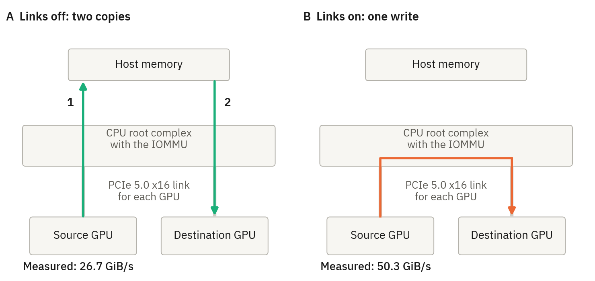

*Figure 7. The two methods to move a tensor between two of the four GPUs. With the direct GPU links off, a transfer
is two copies through host memory. With the links on, the source GPU writes the data into the memory of the
destination GPU, and the IOMMU must permit this write. The speeds are our measurements with a 256 MiB buffer
([`probes/gpu_copy_paths.py`](probes/gpu_copy_paths.py)).*

- **Staged transfer.** The source GPU copies the tensor into a buffer in host memory. Then the destination GPU
  copies the tensor from that buffer. The tensor goes through a PCIe link two times. We measured 26.7 GiB/s.
- **Direct GPU link (PCIe peer-to-peer transfer).** The source GPU writes the tensor directly into the memory of the
  destination GPU. The write goes up the PCIe link of one slot to the root complex of the CPU. Then it goes down the
  PCIe link of the other slot. The data does not go into host memory. We measured 50.3 GiB/s. This speed is almost
  the capacity of one PCIe 5.0 x16 link.

**Is the direct GPU link a function of the motherboard?** No. The peer-to-peer transfer is a part of the PCIe
standard. Its name in CUDA is peer access. Three items are necessary:

1. **The GPUs and the driver must have peer access.** On these GPUs, the driver shows peer access for each pair.
2. **The platform must send a write from one slot to a different slot.** On this host, each GPU slot connects to a
   root port of the CPU. The root complex of the Threadripper PRO sends writes between these root ports. It also
   sends writes between its two host bridges. The motherboard supplies the slots and the firmware defaults. The CPU
   does the transfer between the slots.
3. **The IOMMU must permit the write.** This item was the cause of the problem on our host.

The IOMMU is in the root complex. It examines each address that a device writes to. Linux operated the IOMMU in
translated mode. In this mode, a device can only get access to memory that the kernel put in a map for that device.
The memory of a different GPU is not in that map. Thus the IOMMU prevented each peer write and recorded a fault:

    nvidia 0000:e2:00.0: AMD-Vi: Event logged [IO_PAGE_FAULT domain=0x000d address=0x20000011000 flags=0x0020]

The fault addresses were in the memory ranges of the adjacent GPUs. The four GPUs showed faults in a ring sequence
(3→0→1→2→3).

The application gets no error. The source GPU does not know that the write did not occur, and the
destination GPU gets no data. TensorFold stopped during its start, and its four ranks stayed idle. One month before,
Jovian Judgement stopped with the same symptoms. At that time, we set the direct GPU links of Jovian Judgement to off, but
we did not know the cause.

Two conditions make this problem difficult to find:

- `torch.cuda.can_device_access_peer()` gave the result "true" for each pair during the fault condition. The
  function shows the capability of the driver. It does not do a write. The start check of the TensorFold recipe
  uses this function.
- The root ports have ACS request redirect on. Thus peer traffic goes up to the root complex, where the IOMMU
  examines it.

**The correction** is the kernel parameter `iommu=pt` (passthrough mode). In this mode, devices use physical
addresses directly, and the IOMMU does not filter their writes. You can continue to give devices to virtual
machines. The disadvantage is that host drivers do not have isolation of memory access for each device. This isolation
is most important as a protection from a dangerous device that a person connects during operation.

After the restart, [`probes/p2p_test.py`](probes/p2p_test.py) copied 1 GiB between each of the 12 ordered GPU
pairs. Each copy was equal to its source. The speed was 49.6 GiB/s to 49.9 GiB/s, and the kernel log showed no fault
([`data/gpu_to_gpu_copy.csv`](data/gpu_to_gpu_copy.csv)). We recommend that you do this copy test before you use
one of the recipes.

## Appendix B. Method

We made the measurements on 3, 4, and 5 October 2026, in six sessions. The host did not restart between the sessions.
The model server had no other requests. Appendix A.4 gives the other processes on the GPUs. Each result is from one
run, unless the text gives a different number of runs.

### B.1 Tools

**sparkDash.** We used [sparkDash](https://github.com/MiaAI-Lab/sparkDash) v1.8.9 with no changes. The speed values
in the TensorFold recipe come from this tool.

- The decode test sends greedy requests (temperature 0, top_p 1) with thinking off.
- Each stream writes 400 tokens (`max_tokens` = `min_tokens` = 400, `ignore_eos`).
- The test uses 1, 2, 4, 8, and 16 concurrent streams.
- The speed of one stream is (tokens − 1) ÷ (time of the last token − time of the first token).
- The total speed is the sum of the decode tokens, divided by the time in which the streams decode together.
- There are four prompt types: prose (explain a hash map), code (a different small Python task for each stream),
  the count task (count from 1 to 200), and JSON (write an array of GPU metrics).
- The prefill test sends one cold prompt of 8K to 256K tokens. It measures the time to the first token.

**Our probes.** The directory [`probes/`](probes/) contains them.

- `longctx.py`: C requests with the same long context start at the same time and decode together. We used it with
  a 1K context (greedy, thinking off, 400 tokens). We also used it with a 56K context (temperature 1, thinking on at
  effort max, 2,000 tokens). Before each group of C requests, the probe sends one short request with the same
  context. The context is Python source code from the test host, and each question contains a time value. Thus each
  run of the probe has new prompts. The context and the question are one user message. With the option
  `--context-as-system`, the context is a system message, and the question is the user message.
- `warm_chat.py`: This probe measures the time to the first token for four cases:
  - a cold chat
  - the same chat again
  - the chat and a new turn
  - the chat, the answer of the model, and a new turn
- `burst_reuse.py`: This probe sends four cold requests with a shared prefix at the same time. It records the time
  to the first token, the cached tokens, and the token ids of each reply. The vLLM inference stacks do not give the token ids
  of a reply. For these inference stacks, the probe records the times only.
- `prefix_reuse_check.py`: This probe sends one request at a time. Each request has the 56K context of `longctx.py`
  and a short question. The probe sends a request, the same request again, and the same context with different
  questions. It records the seconds to the full reply of each request. It has one form with the context in the user
  message and one form with the context in a system message.
- `integrity.py`: This probe puts a passphrase in approximately 2K, 30K, and 200K tokens of filler text. Then it
  asks for the passphrase with thinking off. The limit for the answer is 40 tokens.
- `thinkoff_probe.py`: This probe sends the same prompt in two forms. The first form is a chat request with
  thinking-off flags. The second form is a raw completion with a prompt that we rendered manually.
- `reply_equality.py`: This probe sends 36 requests with a seed and records the token ids of each reply. Then it
  compares the replies of two inference stacks.

**How the probes count.**

- The total speed of `longctx.py` is for the time in which all C streams decode together.
- The speed of each stream and the time to the first token are the median of the C streams.
- The vLLM inference stacks give the number of output tokens with each part of a stream. TensorFold gives it only at the end
  of a stream. For TensorFold and TensorFold modified, `longctx.py` thus counts the characters of the stream and
  scales them to the token count at the end.
- The scaled count is exact at the end of a stream. Before the end, it is an estimate. It applies to the results of
  the two TensorFold inference stacks in three tests. These are the long-context test, the test of Appendix C.5, and the
  second test of Appendix C.2.
- The prefill speed is the prompt tokens divided by the time to the first token.

**A check of the estimate.** The request log of TensorFold gives the decode speed of each request. For each wave of
the long-context test, we compared two values. The first value is the total speed from the probe. The second value
is the sum of the request speeds from the log. The comparison uses the waves of sessions 3 and 4 in which each request
found the shared context in the cache. There are 20 of these waves.

| Inference stack | Waves | Speed from the probe, as a percentage of the speed from the log |
|---|---:|---:|
| TensorFold | 8 | 94% to 98% |
| TensorFold modified | 12 | 95% to 98% |

In each of these waves, the value from the probe was 2% to 6% lower than the value from the log. The two values do
not have the same definition. The log uses the decode time of each request, and the probe uses the time in which
all streams decode together. Thus this comparison does not measure the error of the estimate, and it does not give
a limit for that error. In these 20 waves, we found no sign that the estimate increases the speeds of the two
TensorFold inference stacks.
[`data/longctx_estimate_check.csv`](data/longctx_estimate_check.csv) gives each wave.

**The quality harness.** The directory [`quality/`](quality/) contains it. The agent is
[pi](https://github.com/earendil-works/pi) 0.86.1 with no changes. The tasks and the tests are from
[EvalPlus](https://github.com/evalplus/evalplus) 0.3.1. Appendix B.3 gives the method.

### B.2 How we made the requests equal

Three differences between the engines can change the result of a comparison.

**Thinking off.**

- sparkDash asks for thinking off through `chat_template_kwargs` (`enable_thinking: false`).
- TensorFold then renders an empty think block and no effort line.
- The standard chat template of GLM-5.3 has no thinking switch, and Jovian Judgement uses this template. Thus Jovian
  Judgement renders the same prompt, and the model thinks at effort max.
- Jovian Judgement only sets its reasoning parser to off. As a result, the answer text contains the thoughts
  ("17 + 25 = 42</think>42").
- Without a correction, the two engines write different text.

For the tests of Jovian Judgement with 16 slots, we mounted a chat template with two changed lines
([`recipes/glm53-chat-template-thinking-switch.patch`](recipes/glm53-chat-template-thinking-switch.patch)). We used
the same template for all tests of the official vLLM. The tests of Jovian Judgement with 8 slots used the standard
template, and each of these tests has thinking on.

- With thinking on, this template renders the same text as the standard template.
- With thinking off, it renders the text that TensorFold makes: no effort line, and a closed think block.
- [`probes/template_check.py`](probes/template_check.py) makes 32 comparisons of these two types, and it found no
  difference. The script contains a description of the TensorFold text. It does not call TensorFold.
- `thinkoff_probe.py` then sent a chat request and a raw prompt to each engine. The raw prompt is the same text on
  each engine. The two forms had the same prompt token counts (33, 60, and 27 tokens) and the same speeds on each
  engine.

These checks show equal token counts and equal text for the tested prompts. They do not compare the token ids of
each request of the speed tests.

**The prompts.** sparkDash, `thinkoff_probe.py`, `reply_equality.py`, `burst_reuse.py`, and the quality run send
the same prompt text to each inference stack. `longctx.py` and `integrity.py` make new text for each run. Thus their prompts
have the same construction on each inference stack, but not the same text.

**Sampler defaults.** If a request gives no sampler settings, TensorFold uses top_p 0.95 and top_k 20. Jovian Judgement
and the official vLLM use top_p 1.0 and no top_k. Our probes send temperature, top_p, and top_k in each request. The
value -1 for top_k sets top_k to off on each engine.

**Thinking on.** For the long-context test, each engine gets `enable_thinking: true` and `reasoning_effort: max`.
The template of GLM-5.3 then writes the same effort line on each engine.

### B.3 The quality run

The two recipes use different approximations of the model. TensorFold has EXL3 experts at 4 bits for each weight
and FP8 dense layers. Jovian Judgement has NVFP4 experts. The draft methods are also different. Thus equal speed does
not show equal answers. We measured the accuracy of six inference stacks on Python tasks, through an agent.

- **The agent is [pi](https://github.com/earendil-works/pi) 0.86.1.** It is the npm package
  `@earendil-works/pi-coding-agent` with no changes and no extensions. The system prompt and the tool descriptions
  are those of pi.
- **The tasks** are HumanEval+ (164 tasks) and MBPP+ (378 tasks) of EvalPlus 0.3.1. Each task asks for one Python
  function.
- **For each task,** the agent gets a directory that contains the prompt of the task in a file. Each task has the
  same instruction: read the file, and write the function into `solution.py`. The agent can run Python to examine
  its work. It does not get the tests.
- **The agent has four tools:** read, bash, edit, and write. It operates in a container that can connect only to the
  model server.
- **Each request** has temperature 0, thinking on at effort max, and a limit of 32,768 tokens. Thus the sampler
  settings have no effect. The first prompt of each task had 1,384 tokens on each engine.
- **Eight tasks** were in operation at the same time. Each task had a time limit of 1,200 s.
- **The grade** comes from the tests of EvalPlus. "Base tests" are the tests of the original data set. "All tests"
  are the base tests and the added tests of EvalPlus. Each task gets one attempt.
- **The inference stacks** were TensorFold modified, TensorFold, Jovian Judgement r24 (two runs), Jovian Judgement r28.1,
  Jovian Judgement r38, and the official vLLM. The three releases of Jovian Judgement were in the usual 8-slot
  configuration with the direct GPU links on and the standard chat template. The official vLLM was in its default configuration, with 16 slots and
  the chat template with the thinking switch.
- **The statistics.** Each pass rate has a 95% Wilson interval. This interval describes one pass rate for these
  tasks. For each pair of inference stacks, we give the tasks that only one inference stack passes. We also give the difference of the
  two pass rates with its 95% interval, and the exact McNemar test.
- **What the test can show.** A paired test that finds no difference does not show that two inference stacks are equal.

The agent can run its code, read the errors, and write the file again. **Do not compare these scores with scores
from single requests.** [`quality/README.md`](quality/README.md) gives the settings of the harness and the commands.

### B.4 The equality tests of TensorFold modified

The changes of TensorFold modified must not change the replies. For nine of its eleven groups of settings, we
compared the replies of TensorFold modified with the replies of TensorFold before the speed tests. The two other
groups are the larger prefill chunks and the profiler (Appendix E.5). Section 8 gives the results.

- **The gates of the recipe.** The tool `tf_bench.py` of the recipe compares reply hashes for greedy requests and
  for requests with a sampler. It does this with and without draft tokens, and at 4, 8, and 16 concurrent requests.
  It also has five requests with tool calls, one request with an image, and prompts of 8K, 32K, and 100K tokens. We
  stored the references on TensorFold.
- **36 requests with a seed** (`reply_equality.py`). The set contains greedy requests, top_k, top_p with no top_k,
  top_p 1.0 with no top_k, min_p, and three temperatures. The probe compares the token ids of each reply.
- **Four cold requests with a shared prefix** (`burst_reuse.py`). The probe compares the token ids of each reply.
- **A synthetic check on the four GPUs.** With no model, the check compares 256 rows of each new sampler path with
  the CPU rule of TensorFold.

### B.5 Sessions and test sequence

| Session | Local time | Inference stacks and tests |
|---|---|---|
| 1 | 3 October, 19:11 to 20:28 | TensorFold and Jovian Judgement r24: all speed tests |
| 2 | 3 October, 22:17 to 22:56 | The official vLLM in two configurations: all speed tests |
| 3 | 3 October, 23:41 to 23:59 | TensorFold and Jovian Judgement r24: the long-context test with top_k 20 |
| 4 | 4 October, 00:43 to 04:11 | TensorFold modified: equality tests and speed tests. The quality run on three inference stacks. |
| 5 | 4 October, 14:39 to 18:18 | Jovian Judgement r24: a second quality run and the test with four cold requests. Jovian Judgement r28.1: all tests. The official vLLM: the long-context test with top_k 20, the test with four cold requests, and a quality run. The prompt-reuse check on each of these inference stacks. |
| 6 | 5 October, 13:09 to 15:27 | Jovian Judgement r38: all tests. Jovian Judgement r24: a control run with 16 slots, and four tests in its usual configuration. |

One measurement is from before these sessions and before the last restart of the host. It is the prefill speed of
Jovian Judgement with the direct GPU links off and 16 slots (Appendix C.7).

1. We stopped Jovian Judgement and the other GPU process.
2. We did the GPU copy test.
3. We prepared TensorFold (compile and tune of the kernels, 212 s) and started it (362 s to load).
4. We did the test suite on TensorFold. Then we stopped TensorFold.
5. We started Jovian Judgement with 16 slots and the direct GPU links on (390 s).
6. We did the test suite on Jovian Judgement.
7. We started Jovian Judgement again in its usual 8-slot configuration for section 6.
8. Later on the same day, we stopped Jovian Judgement and started the official vLLM in its default configuration.
9. We did the test suite on the official vLLM. Then we did the two sparkDash tests a second time.
10. We did steps 8 and 9 again for the tuned configuration.
11. In the third session, we started TensorFold again. We did the long-context test three times: with top_k 20, with
    no top_k, and with top_k 20 again.
12. We started Jovian Judgement with 16 slots and did the same three tests.
13. In the fourth session, we started TensorFold and stored the references for the equality tests.
14. We started TensorFold modified 11 times, each time with one group of settings. After each start, we did the
    equality tests and then the speed tests for that group.
15. We did the quality run on TensorFold modified, then on TensorFold, and then on Jovian Judgement.
16. In the fifth session, we did the test with four cold requests and a second quality run on Jovian Judgement r24 in
    its usual configuration.
17. We started release r28.1 of Jovian Judgement with 16 slots. We did the long-context test three times, and the
    test gave no speed. Then we did the prompt-reuse check and the test with four cold requests.
18. We started release r28.1 again with `--prefix-cache-retention-interval None` and did the prompt-reuse check.
19. We started release r28.1 again with the settings of step 17. We did the test suite without its two long-context
    steps.
20. We started release r28.1 with 8 slots. We did the test with four cold requests and the quality run. For the
    last 17 minutes of that run, two tasks waited for a command of the agent, and the server had no requests. In
    that time, we did the prompt-reuse check and the long-context test with the context in a system message.
21. We started release r28.1 with 16 slots and `--recurrent-checkpoint-policy aligned`. We did the prompt-reuse
    check, the long-context test three times, the test suite, and the test with four cold requests. Then we did the
    long-context test with the context in a system message.
22. We started the official vLLM in its default configuration. We did the prompt-reuse check, the quality run, the
    long-context test three times, and the test with four cold requests.
23. We did step 22 for the tuned configuration, without the quality run.
24. We started Jovian Judgement r24 in its usual configuration. We did the prompt-reuse check and the long-context
    test with the context in a system message.
25. In the sixth session, Jovian Judgement r24 was in operation in its usual configuration. We did the
    short-context probe of Appendix C.9, the prompt-reuse check, the test suite without its two long-context
    steps, and the test with four cold requests.
26. We started release r38 of Jovian Judgement with 16 slots. We did the prompt-reuse check and the long-context
    test with top_k 20, and that test gave no speed. Then we did the test suite without its two long-context steps,
    and the test with four cold requests.
27. We started release r38 with 16 slots and `--recurrent-checkpoint-policy aligned`. We did the prompt-reuse
    check, the long-context test three times, the test suite, and the test with four cold requests. Then we did the
    long-context test with the context in a system message.
28. We started release r38 with 8 slots. We did the prompt-reuse check, the short-context probe, the test with four
    cold requests, and the long-context test with the context in a system message. Then we did the test suite
    without its two long-context steps, the two sparkDash tests a second time, and the quality run.
29. We started release r24 with 16 slots. We did the test suite, the long-context test three times, and the test
    with four cold requests. This is the control run of Appendix C.9.

The test suite of steps 4, 6, 9, 19, 21, 26, 27, and 29 is the sequence in [`recipes/method.md`](recipes/method.md).

### B.6 Variation between runs

A table cell with more than one run shows the mean of the runs. [`data/`](data/) contains each run, and
[`data/README.md`](data/README.md) gives the name of each run.

- **The sparkDash tests** have one run on TensorFold, on TensorFold modified, and on Jovian Judgement. In tests before
  these sessions, greedy cells on Jovian Judgement changed by 3% to 6% between runs. Those tests are not in this
  repository.
- **The official vLLM.** We did the sparkDash tests two times on each of its two configurations, and the tables show the second run.
  The first run was slower in some cells (Appendix C.2).
- **The long-context test with no top_k** has two runs on TensorFold and on Jovian Judgement, approximately four hours
  apart. The difference was 3% or less on TensorFold and 5% or less on Jovian Judgement.
- **The long-context test with top_p 0.95 and top_k 20** has two runs on each inference stack. Release r38 with its
  default settings has one run. The difference between the two runs was
  1% to 4% on TensorFold and 0% to 9% on Jovian Judgement. On TensorFold modified, it was 1% to 9%. On Jovian
  Judgement r28.1 with the policy `aligned`, it was 1% to 5%. The last item of this list gives the official vLLM.
- **The quality run** has two runs on Jovian Judgement r24 and one run on each other inference stack. The two runs of
  release r24 passed 478 and 475 tasks, and they had a different result for 29 tasks. TensorFold and TensorFold
  modified have the same weights, and their two runs were different for 3 of 542 tasks (Appendix D.1).
- **Release r28.1 of Jovian Judgement** has two runs of the sparkDash tests: one with its default settings and one
  with the policy `aligned`. In the cells of the table in Appendix C.8, the difference between the two runs was
  9% or less.
- **Release r38 of Jovian Judgement** has the same two runs. In the cells of the table in Appendix C.9, the
  difference between the two runs was 10% or less.
- **Release r24 has a second run of the sparkDash tests with 16 slots,** in session 6 (Appendix C.9). In the decode
  test, 19 of its 20 cells were in a range of 10% from the run of session 1. Prose at 2 requests gave 286 tokens/s,
  and it gave 378 tokens/s in session 1. In the prefill test, five of the six cells were in a range of 2%.
- **The long-context test on the official vLLM** has two runs for each cell with top_p 0.95. With no top_k, the
  runs of sessions 2 and 5 were different by 4% or less. With top_k 20, the two runs of session 5 were different
  by 1% to 3% in the default configuration. In the tuned configuration, they were different by 5% to 12%.

Cells with a sampler change more than greedy cells, because the number of accepted draft tokens changes with the
text. A difference of less than 10% between two inference stacks in one run is not a reliable result.

## Appendix C. Full speed results

Each table shows the total tokens/s, unless it gives a different unit. `scripts/make_tables.py` makes each table
from [`data/`](data/).

### C.1 All tests in one table

The table shows one line for each test.

| Test | TensorFold | TensorFold modified | Jovian Judgement r24 | Jovian Judgement r28.1 | Jovian Judgement r38 | Official vLLM: default / tuned |
|---|---:|---:|---:|---:|---:|---:|
| Short greedy answers (prose), 1 request, tokens/s | 247 | 261 | 225 | 239 | 250 | 185 / 191 |
| Short greedy answers (prose), 16 requests, tokens/s | 1,091 | 1,134 | 1,105 | 1,079 | 1,059 | 866 / 958 |
| Prefill of a cold prompt of 64K tokens, tokens/s | 9,263 | 9,370 | 11,141 | 10,929 | 11,559 | 7,079 / 6,741 |
| 56K context, thinking on, top_p 0.95, top_k 20, 16 requests, tokens/s | 778 | 797 | 1,123 | no value | no value | 841 / 978 |
| The same test with no top_k | 482 | 806 | 1,140 | no value | no test | 816 / 963 |
| The same test with top_p 1.0 and no top_k, 4 requests | 40 | 391 | 579 | no test | no test | 382 / 445 |
| First token for a new turn on a chat of 83.6K tokens, s | 0.3 | 0.3 | 0.6 | 0.4 | 0.3 | 0.7 / 0.7 |
| First token for the same prompt of 83.6K tokens a second time, s | 0.1 | 0.1 | 7.9 | 0.1 | 0.1 | 0.5 / 0.5 |
| First token for four cold requests with a shared prefix of 42K tokens, s | 9 to 22 | 5.5 | 4.4 to 8.8 | 4.5 to 16.5 | 4.7 to 17.0 | 8.8 to 14.7 / 9.1 to 15.1 |
| Python tasks that pass all tests through the pi agent, of 542 | 475 | 476 | 478 and 475 | 469 | 472 | 479 / no test |
| Median time for a model call in the agent run, s | 0.88 | 0.80 | 1.48 and 1.61 | 0.87 | 0.84 | 1.63 / no test |

In this table, the values of TensorFold modified are from its last configuration (Appendix A.3), with one exception.
The test with four cold requests had the sampler settings and burst reuse on, and CUDA IPC off. The columns of Jovian
Judgement r28.1 and r38 show these releases with their default settings. In the test with four cold requests, the
three releases of Jovian Judgement had 8 slots. "No value" is a test that gave no speed (section 4).

### C.2 Short greedy answers

Section 2 gives the summary of this test and Figure 2.

| Output | Inference stack | 1 | 2 | 4 | 8 | 16 |
|---|---|---:|---:|---:|---:|---:|
| Prose | TensorFold | 247 | 419 | 594 | 844 | 1,091 |
|  | TensorFold, published values | 264 | 434 | 586 | 821 | 1,061 |
|  | TensorFold modified | 261 | 427 | 588 | 871 | 1,134 |
|  | Jovian Judgement r24 | 225 | 378 | 604 | 799 | 1,105 |
|  | Jovian Judgement r28.1 | 239 | 367 | 575 | 775 | 1,079 |
|  | Jovian Judgement r38 | 250 | 362 | 553 | 775 | 1,059 |
|  | Official vLLM, default | 185 | 277 | 427 | 593 | 866 |
|  | Official vLLM, tuned | 191 | 301 | 435 | 637 | 958 |
| Code | TensorFold | 426 | 626 | 773 | 1,040 | 1,319 |
|  | TensorFold, published values | 430 | 613 | 760 | 1,014 | 1,268 |
|  | TensorFold modified | 422 | 590 | 807 | 1,077 | 1,350 |
|  | Jovian Judgement r24 | 315 | 510 | 721 | 934 | 1,265 |
|  | Jovian Judgement r28.1 | 316 | 503 | 566 | 852 | 1,123 |
|  | Jovian Judgement r38 | 301 | 445 | 520 | 825 | 1,088 |
|  | Official vLLM, default | 210 | 352 | 485 | 689 | 955 |
|  | Official vLLM, tuned | 247 | 379 | 506 | 710 | 826 |
| Count task | TensorFold | 498 | 816 | 1,020 | 1,427 | 1,930 |
|  | TensorFold, published values | 540 | 878 | 1,018 | 1,487 | 2,041 |
|  | TensorFold modified | 500 | 806 | 1,054 | 1,501 | 2,015 |
|  | Jovian Judgement r24 | 342 | 586 | 890 | 1,433 | 1,739 |
|  | Jovian Judgement r28.1 | 340 | 557 | 904 | 1,339 | 1,600 |
|  | Jovian Judgement r38 | 347 | 492 | 845 | 1,375 | 1,715 |
|  | Official vLLM, default | 245 | 428 | 649 | 982 | 1,461 |
|  | Official vLLM, tuned | 259 | 437 | 641 | 1,097 | 1,785 |
| JSON | TensorFold | 349 | 561 | 853 | 1,260 | 1,475 |
|  | TensorFold modified | 352 | 555 | 885 | 1,303 | 1,457 |
|  | Jovian Judgement r24 | 325 | 516 | 732 | 1,044 | 1,516 |
|  | Jovian Judgement r28.1 | 307 | 510 | 749 | 1,026 | 1,486 |
|  | Jovian Judgement r38 | 329 | 447 | 697 | 970 | 1,344 |
|  | Official vLLM, default | 218 | 347 | 492 | 794 | 1,011 |
|  | Official vLLM, tuned | 239 | 383 | 590 | 847 | 1,177 |

The table shows the total tokens/s for each number of concurrent requests. Each row is one run. For the official
vLLM, the table shows the second of two runs on each of its two configurations. The published values are from the README of the
TensorFold recipe. The file [`data/decode_sparkdash.csv`](data/decode_sparkdash.csv) contains the speed of each
stream and the time to the first token.

- **TensorFold and Jovian Judgement at 1 and 2 requests.** TensorFold was faster in each cell. At one request, it was
  10% faster than Jovian Judgement for prose, 35% for code, 46% for the count task, and 7% for JSON.
- **TensorFold and Jovian Judgement at 16 requests.** The difference was 4% or less for prose, code, and JSON. For the
  count task, TensorFold was 11% faster. We have one run for each cell, and 4% is less than the variation between
  runs (Appendix B.6).
- **A possible cause** of the advantage at small batches is the drafter of TensorFold. Simple text gives more
  accepted draft tokens in each round. We did not measure this.
- **TensorFold and its published values.** TensorFold gave the decode speeds that its recipe publishes. The
  difference was 8% or less in each of the 15 cells that we compared.
- **TensorFold modified** gave 94% to 106% of the speed of TensorFold in each cell. Its changes do not apply to
  greedy requests.
- **The official vLLM.** In the default configuration, it gave 67% to 84% of the decode speed of Jovian Judgement. The
  mean was 72%. In the tuned configuration, it gave 65% to 103%, and the mean was 78%.
- **The two runs on the official vLLM.** In the default configuration, the first run was 13% to 26% slower than the
  second run in six cells at 8 and 16 streams. In the other cells, the difference was 5% or less, with one
  exception. We did not find the cause. In the tuned configuration, the difference between the two runs was 8% or
  less, with one exception. Code at 16 streams gave 1,001 tokens/s and then 826 tokens/s.
  [`data/decode_sparkdash.csv`](data/decode_sparkdash.csv) contains the two runs.
- **Jovian Judgement r28.1** gave 89% to 106% of the speed of release r24 at 1 and
  at 16 requests. For code at 4 requests, release r28.1 gave 566 tokens/s, and release r24 gave 721 tokens/s (79%). A
  second run of release r28.1, with the policy `aligned`, gave 716 tokens/s in that cell. Thus we do not know the
  cause of the low value. Appendix C.8 gives the second run.
- **Jovian Judgement r38** gave 86% to 111% of the speed of release r24 at 1 and at 16 requests. In the same session,
  a control run of release r24 gave 93% to 103% of its speed of session 1 in these cells. At 2 to 16 requests, the
  two runs of release r38 were slower than the control run for code and for JSON. They gave 73% to 96% of its
  speed. Each value is one run, and one cell of the control run was 24% lower than in session 1. Thus we do not
  know if release r38 is slower for these two output types. Appendix C.9 gives the control run.

Our second greedy test used approximately 1K tokens of source code as context, thinking off, and 400 tokens of
output. The columns show the number of concurrent requests. In this test, Jovian Judgement was 6% faster than
TensorFold at 16 requests, and the difference was 1% at one request.

| Inference stack | 1 | 8 | 12 | 16 |
|---|---:|---:|---:|---:|
| TensorFold | 233 | 746 | 885 | 1,000 |
| TensorFold modified | 219 | 761 | 889 | 1,033 |
| Jovian Judgement r24 | 230 | 763 | 928 | 1,062 |
| Jovian Judgement r28.1 | 227 | 742 | 896 | 1,031 |
| Jovian Judgement r38 | 225 | 776 | 892 | 1,034 |
| Official vLLM, default | 163 | 572 | 722 | 848 |
| Official vLLM, tuned | 190 | 610 | 781 | 931 |

### C.3 Prefill of a cold prompt

Section 3 gives the summary of this test and Figure 3.

| Inference stack | 8K | 16K | 32K | 64K | 128K | 256K |
|---|---:|---:|---:|---:|---:|---:|
| TensorFold | 8,300 | 8,729 | 9,093 | 9,263 | 9,100 | 8,679 |
| TensorFold, published values | 8,416 | 6,903 | 6,508 | 5,527 | 8,272 | 7,842 |
| TensorFold modified | 7,274 | 8,868 | 9,220 | 9,370 | 9,200 | 8,766 |
| Jovian Judgement r24, direct GPU links on | 10,787 | 11,160 | 11,235 | 11,141 | 10,160 | 10,030 |
| Jovian Judgement r24, direct GPU links off (8 slots) | 6,802 | 7,012 | 7,090 | 7,070 | 6,950 | 6,718 |
| Jovian Judgement r28.1 | 10,353 | 10,752 | 10,989 | 10,929 | 9,907 | 9,850 |
| Jovian Judgement r38 | 11,455 | 11,679 | 11,704 | 11,559 | 10,216 | 10,258 |
| Official vLLM, default | 6,862 | 6,995 | 7,078 | 7,079 | 6,987 | 6,686 |
| Official vLLM, tuned | 6,500 | 6,655 | 6,701 | 6,741 | 6,655 | 6,496 |

The table shows the prompt tokens/s. The published values are from the README of the TensorFold recipe. The row of
Jovian Judgement with the links off is the 8-slot configuration of section 6. For the official vLLM, the table shows
the second of two runs.

- **Jovian Judgement was 12% to 30% faster than TensorFold.** The two engines kept their prefill speed up to 256K
  tokens. A 256K prompt got its first token after 26.1 s on Jovian Judgement and after 30.2 s on TensorFold.
- **TensorFold and its published values.** From 16K to 64K, TensorFold was faster on our host than its published
  values. We did not find the cause.
- **TensorFold modified** gave 101% to 102% of the speed of TensorFold from 16K to 256K tokens. At 8K tokens it gave
  88%. Its changes do not apply to the prefill of one prompt.
- **The official vLLM gave 60% to 69% of the prefill speed of Jovian Judgement.** In its default configuration, its
  speed was near to the speed of Jovian Judgement with the direct GPU links off. The difference was 1% or less. In
  these two cases, NCCL does the all-reduce in prefill. In the default configuration, a 256K prompt got its first
  token after 39.2 s.
- **The tuned configuration of the official vLLM did not help prefill.** Its PCIe all-reduce operates on a maximum
  of 256 tokens, and a prefill step has 8,192 tokens. This configuration was 3% to 5% slower in prefill than the
  default configuration.
- **Jovian Judgement r28.1** gave 96% to 98% of the prefill speed of release
  r24. With the policy `aligned`, it gave 97% to 105% (Appendix C.8).
- **Jovian Judgement r38** gave 101% to 106% of the prefill speed of release r24. For prompts of 8K to 64K tokens,
  it gave 104% to 108% of the speed of the control run of the same session. With the policy `aligned`, it gave
  103% to 105% of that speed for each prompt size (Appendix C.9).

### C.4 Long shared context with thinking on

Section 4 gives the summary of this test, the table, and Figure 4.

- **Two runs.** With top_k 20, each cell is the mean of two runs, but release r38 with its default settings has one
  run. With top_p 0.95 and no top_k, each cell is the
  mean of two runs, but the cells of TensorFold modified are one run. With top_p 1.0, each cell is one run. The
  time to the first token of release r28.1 with its default settings is from one run.
  [`data/concurrent_waves.csv`](data/concurrent_waves.csv) and
  [`data/modified_arms.csv`](data/modified_arms.csv) contain each run.
- **The cache.** The time to the first token is from the test with top_p 0.95 and no top_k. In that test, each
  request found the shared context in the cache, with one exception that the end of this item gives. In the first
  of the two runs with top_k 20, the wave of 4 requests
  did not find the context in the cache (Appendix C.6). The decode speed is for the time after the prefill.
  For that cell, the two runs gave 480 and 463 tokens/s on TensorFold. They gave 484 and 444 tokens/s on TensorFold
  modified, and 588 and 540 tokens/s on Jovian Judgement. On Jovian Judgement r28.1 and r38 with their default
  settings, no request found the context in the cache.
- **The token count** of the two TensorFold inference stacks is an estimate in this test (Appendix B.1).

The results are:

- **With top_p 0.95 and top_k 20,** Jovian Judgement was 1.2, 1.2, and 1.4 times faster than TensorFold at 4, 8, and 16
  requests.
  Top_k 20 is the default of TensorFold. With a top_k value, TensorFold uses its GPU sampler (Appendix E.2).
- **With top_p 0.95 and no top_k,** Jovian Judgement was 1.7, 1.9, and 2.4 times faster than TensorFold. With top_k off, TensorFold
  makes each sampler decision on the CPU. The top_k setting changed the speed of TensorFold by 45% to 62%. It did not
  change the speed of Jovian Judgement.
- **TensorFold modified with top_p 0.95** had the same speed with top_k 20 and with no top_k. The difference was 3%
  or less. With top_k 20, it was equal to TensorFold. With no top_k, it was 1.5 to 1.7 times faster than TensorFold.
- **TensorFold modified with top_p 1.0 and no top_k** did not have the decrease of TensorFold. Its speed was 16%
  lower than with top_k 20 at 4 requests, and 1% lower at 8 and 16 requests. The time for a round was not longer
  (see the table below). At 4 requests, each round wrote fewer tokens: 2.4, and 2.8 to 3.2 with the other settings.
- **Jovian Judgement stayed 1.2 to 1.5 times faster than TensorFold modified** for each group of sampler settings.
- **The official vLLM with top_p 0.95** gave 68% to 75% of the speed of Jovian Judgement in the default
  configuration. In the tuned configuration, it gave 80% to 87%. These ranges contain the cells with top_k 20 and
  the cells with no top_k.
- **The official vLLM and TensorFold with no top_k.** The official vLLM was 1.2 to 1.7 times faster than
  TensorFold in the default configuration, and 1.4 to 2.0 times faster in the tuned configuration. In the
  tuned configuration, it had the speed of TensorFold modified at 4 and 8 requests, with a difference of 3% or
  less. At 16 requests, it was 19% faster than TensorFold modified.
- **The official vLLM and TensorFold with top_k 20.** In the default configuration, the official vLLM was 17%
  slower than TensorFold at 4 and 8 requests, and 8% faster at 16 requests. In the tuned configuration, it had
  the speed of TensorFold at 4 and 8 requests, with a difference of 1% or less. At 16 requests, it was
  26% faster.
- **Jovian Judgement r28.1 with its default settings** did the prefill of the context again for each request. One
  request wrote its tokens while the subsequent request did its prefill. Thus two requests wrote tokens together
  for some seconds, but no time interval contained the output of all requests. The probe gives a speed only for
  such an interval. The test has three runs. The median time to the first token
  was 24 s to 26 s at 4 requests and 49 s to 50 s at 8 requests. At 16 requests, it was 98 s to 101 s. During these
  runs, each status line of the server log showed a prefix cache hit rate of 0.0%
  (`raw/session5/jovian-judgement-r28.1-16-slots/first-start-prefix-cache-hit-rate.log`).
  [`data/concurrent_waves.csv`](data/concurrent_waves.csv) gives these rows with the status `no_overlap`.
- **Jovian Judgement r28.1 with the policy `aligned`** had the speed of release r24. The difference was
  5% or less in each cell.
- **Jovian Judgement r38 with its default settings** had the result of release r28.1. The test has one run, with
  temperature 1, top_p 0.95, and top_k 20. The median time to the first token was 24 s at 4 requests, 46 s at 8
  requests, and 95 s at 16 requests.
- **Jovian Judgement r38 with the policy `aligned`** gave 93% to 104% of the speed of release r24 in the cells of
  the table. In each run, it gave 97% to 106% of the speed of the control run of the same session (Appendix C.9).
- **TensorFold and TensorFold modified gave the first token in the least time.** With the context in the cache,
  their time to the first token was approximately half that of Jovian Judgement.

The request log of TensorFold gives the number of rounds of each request. The time for one round is the decode
time of a request divided by its rounds. TensorFold wrote 2.8 to 3.2 tokens in each round, for each group of settings
and each number of requests. The table shows the median of the requests of a wave, in milliseconds. A cell with two
waves shows the mean of the two medians. Waves that did not find the context in the cache are not in the table.

| Requests | TensorFold, top_k 20 | TensorFold, no top_k | TensorFold modified, top_k 20 | TensorFold modified, no top_k | TensorFold modified, top_p 1.0 |
|---:|---:|---:|---:|---:|---:|
| 4 | 24 | 34 | 25 | 26 | 24 |
| 8 | 35 | 49 | 34 | 35 | 34 |
| 16 | 55 | 90 | 55 | 56 | 52 |

On TensorFold with no top_k, the sampler on the CPU makes a round longer, and the effect increases with the number
of requests. On TensorFold modified, the time for a round does not change with the sampler settings.
[`data/tensorfold_round_times.csv`](data/tensorfold_round_times.csv) gives each wave of requests.

### C.5 Sampler settings and TensorFold

With top_p 1.0 and no top_k, TensorFold gave a total of 40 tokens/s for four streams in the long-context test. We
stopped that run after its first wave. Then we did tests with four streams and a 1K context to find the cause.

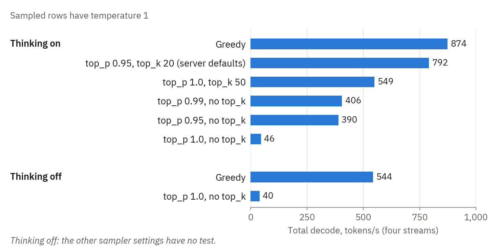

*Figure 8. TensorFold with four streams, approximately 1K tokens of context, and 400 tokens for each stream. Each
bar is one run.*

| Sampler settings | Thinking | Total tokens/s | Tokens/s for each stream |
|---|---|---:|---:|
| Greedy | on | 874 | 222 |
| Temperature 1, server defaults (top_p 0.95, top_k 20) | on | 792 | 158 |
| Temperature 1, top_p 1.0, top_k 50 | on | 549 | 128 |
| Temperature 1, top_p 0.99, no top_k | on | 406 | 104 |
| Temperature 1, top_p 0.95, no top_k | on | 390 | 90 |
| Temperature 1, top_p 1.0, no top_k | on | 46 | 11 |
| Greedy | off | 544 | 130 |
| Temperature 1, top_p 1.0, no top_k | off | 40 | 10 |

- **The decrease occurred when the sampler used the full vocabulary:** top_p 1.0 with no top_k. It also occurred
  with a short context and with thinking off. Appendix E.2 gives the cause from the source code of TensorFold.
- **During the decrease, the GPUs were almost idle.** The telemetry of the host showed a GPU load of 3% to 37% and a
  GPU power of 71 W to 91 W. We read these values during the run. They are not in `raw/`.
- **With top_p 0.99 and top_p 0.95, the decrease did not occur,** but the sampler stays on the CPU. These rows gave
  406 tokens/s and 390 tokens/s. We did no test of other top_p values.
- **A top_k value moves the sampler to the GPU.** These rows gave 549 tokens/s with top_k 50 and 792 tokens/s with
  the server defaults, which contain top_k 20.
- **The other inference stacks showed no decrease.** At top_p 1.0 with no top_k and 4 requests, the long-context test gave
  579 tokens/s on Jovian Judgement. It gave 382 and 445 tokens/s on the official vLLM, and 391 tokens/s on TensorFold
  modified.
- **TensorFold modified** gave 760 tokens/s in the test of this section with top_p 1.0 and no top_k (thinking on).
  TensorFold gave 46 tokens/s. This run of TensorFold modified had the three sampler settings on, and burst reuse
  and CUDA IPC off.

A client that sends no sampler settings does not get this decrease on TensorFold, because the server defaults are
top_p 0.95 and top_k 20. A client that sends top_p 1.0 and no top_k gets the decrease.

### C.6 Time to the first token, and reuse of a prompt

Section 5 gives the summary of this test.

The table shows the seconds to the first token for two runs of each case. The small prompt has 13.5K tokens, and
the large prompt has 83.6K tokens.

| Prompt | Inference stack | Cold | Same prompt again | Same prompt and a new turn | Answer of the model and a new turn |
|---|---|---:|---:|---:|---:|
| 13.5K | TensorFold | 1.98, 2.54 | 0.06, 0.04 | 0.29, 1.94 | 0.27, 0.25 |
|  | TensorFold modified | 1.92, 2.47 | 0.05, 0.04 | 0.28, 1.95 | 0.27, 0.28 |
|  | Jovian Judgement r24 | 1.23, 1.23 | 1.28, 1.30 | 0.41, 0.41 | 0.43, 0.42 |
|  | Jovian Judgement r28.1 | 1.27, 1.26 | 0.04, 0.04 | 1.35, 1.34 | 0.34, 0.33 |
|  | Jovian Judgement r28.1, policy aligned | 1.24, 1.23 | 0.34, 0.33 | 0.41, 0.41 | 0.43, 0.42 |
|  | Jovian Judgement r38 | 1.25, 1.23 | 0.05, 0.05 | 1.29, 1.29 | 0.33, 0.31 |
|  | Jovian Judgement r38, policy aligned | 1.22, 1.21 | 0.41, 0.42 | 0.58, 0.57 | 0.56, 0.54 |
|  | Official vLLM, default | 1.99, 1.96 | 0.61, 0.61 | 0.77, 0.77 | 0.78, 0.78 |
|  | Official vLLM, tuned | 2.01, 2.00 | 0.62, 0.62 | 0.78, 0.78 | 0.80, 0.79 |
| 83.6K | TensorFold | 10.3, 10.3 | 0.16, 0.02 | 0.37, 10.4 | 0.32, 0.29 |
|  | TensorFold modified | 10.2, 10.2 | 0.18, 0.02 | 0.39, 10.4 | 0.34, 0.28 |
|  | Jovian Judgement r24 | 8.0, 8.0 | 7.9, 7.9 | 0.56, 0.56 | 0.57, 0.56 |
|  | Jovian Judgement r28.1 | 8.3, 8.1 | 0.14, 0.13 | 8.2, 8.2 | 0.42, 0.42 |
|  | Jovian Judgement r28.1, policy aligned | 8.1, 8.1 | 0.49, 0.47 | 0.58, 0.57 | 0.58, 0.57 |
|  | Jovian Judgement r38 | 7.8, 7.6 | 0.14, 0.14 | 7.9, 7.7 | 0.32, 0.33 |
|  | Jovian Judgement r38, policy aligned | 7.6, 7.6 | 0.55, 0.54 | 0.72, 0.68 | 0.74, 0.72 |
|  | Official vLLM, default | 12.3, 12.2 | 0.54, 0.56 | 0.66, 0.69 | 0.70, 0.69 |
|  | Official vLLM, tuned | 12.1, 12.3 | 0.54, 0.56 | 0.69, 0.68 | 0.69, 0.70 |

- **A cold prompt.** Jovian Judgement gave the first token of the large prompt after 8.0 s. TensorFold used 10.3 s, and
  the official vLLM used 12.2 s. These times agree with the prefill speeds of Appendix C.3.
- **The same prompt again.** TensorFold, TensorFold modified, the official vLLM, and Jovian Judgement r28.1 and r38
  used their cache. Jovian Judgement r24 did the prefill again. With MTP draft tokens, release r24 finds no cache entry
  for a prompt that stops at the same point as an earlier prompt.
- **The answer of the model and a new turn.** Each inference stack used its cache for a conversation that has one more turn.
  The first token came after 0.3 s on TensorFold and after 0.7 s on the official vLLM. It came after 0.6 s on
  Jovian Judgement r24, after 0.4 s on release r28.1, and after 0.3 s on release r38.
- **The same prompt and a new turn, with no answer between.** TensorFold and TensorFold modified did the full prefill
  again in one of the two rounds. The cause is below. Jovian Judgement r28.1 and r38 with their default settings
  did the full prefill again in each round. With the policy `aligned`, they used their cache.

**The prompt-reuse check.** Section 5 gives this check for six configurations. The first table shows each inference stack that
has the check, with the context and the question in one user message. The second table shows the second form of the
check: the context is a system message, and the question is the user message. The tables show the seconds to the
full reply. "Dense retention" is release r28.1 with `--prefix-cache-retention-interval None` and the default policy.

| Step | Jovian Judgement r24, 8 slots | Jovian Judgement r28.1, 16 slots | Jovian Judgement r28.1, dense retention, 16 slots | Jovian Judgement r28.1, policy aligned, 16 slots | Jovian Judgement r38, 16 slots | Jovian Judgement r38, policy aligned, 16 slots | Official vLLM, default, 16 slots | Official vLLM, tuned, 16 slots |
|---|---:|---:|---:|---:|---:|---:|---:|---:|
| 1. A context of 56K tokens and a question | 5.42 | 5.30 | 5.10 | 5.25 | 7.67 | 5.03 | 9.20 | 8.63 |
| 2. The same request again | 5.21 | 0.28 | 0.21 | 0.50 | 0.28 | 0.58 | 0.65 | 0.65 |
| 3. The same context and a different question | 0.47 | 5.32 | 5.13 | 0.47 | 4.89 | 0.55 | 0.70 | 0.66 |
| 4. The request of step 1, with 300 output tokens | 1.54 | 1.25 | 1.14 | 1.51 | 1.25 | 1.54 | 2.22 | 1.98 |
| 5. The request of step 1 again | 0.45 | 0.16 | 0.17 | 0.45 | 0.19 | 0.44 | 0.64 | 0.64 |
| 6. The same context and a third question | 0.45 | 5.31 | 5.14 | 0.47 | 4.93 | 0.44 | 0.66 | 0.64 |

| Step | Jovian Judgement r24, 8 slots | Jovian Judgement r28.1, 8 slots | Jovian Judgement r28.1, policy aligned, 16 slots | Jovian Judgement r38, 8 slots | Jovian Judgement r38, policy aligned, 16 slots | Official vLLM, default, 16 slots | Official vLLM, tuned, 16 slots |
|---|---:|---:|---:|---:|---:|---:|---:|
| 1. A system message of 56K tokens and a question | 5.15 | 5.30 | 5.17 | 5.10 | 4.82 | 8.09 | 8.06 |
| 2. The same request again | 5.23 | 0.24 | 0.46 | 0.43 | 0.44 | 0.64 | 0.63 |
| 3. The same system message and a different question | 0.46 | 0.27 | 0.47 | 0.42 | 0.52 | 0.65 | 0.66 |
| 4. The same system message and a third question | 0.46 | 0.26 | 0.47 | 0.28 | 0.44 | 0.66 | 0.67 |

- **Jovian Judgement r28.1 with its default settings** used its cache for a different question when the context
  was a system message. The reply came after 0.26 s to 0.27 s.
- **Jovian Judgement r38 with its default settings** had the same result. The reply came after 0.28 s to 0.42 s.
- **Jovian Judgement r24** had the same result in the two forms. In step 2, it did the prefill again for the same
  request. Then it used its cache for a different question. In step 5 of the first form, it used its cache for the
  same request.
- **The official vLLM** used its cache in each step after step 1, in the two forms. **Jovian Judgement r28.1 and
  r38 with the policy `aligned`** did the same.
- **Step 1 on the official vLLM in the default configuration** was the first long prompt after the start of the
  server. The same applies to step 1 on release r38 with 16 slots and its default settings.

**Requests that arrive together.** Four requests started at the same time on a server with an empty cache. Each
prompt had 42,250 tokens, and the four prompts were different only at the end. Each request had temperature 1,
top_p 0.95, top_k 20, and 128 output tokens. The first table shows TensorFold and TensorFold modified. TensorFold modified had the three sampler settings and burst reuse on, and CUDA IPC off.

| Request | TensorFold: time to first token, s | TensorFold: cached tokens | TensorFold modified: time to first token, s | TensorFold modified: cached tokens |
|---:|---:|---:|---:|---:|
| 1 | 9.0 | 0 | 5.5 | 0 |
| 2 | 21.8 | 0 | 5.5 | 42,240 |
| 3 | 18.6 | 0 | 5.5 | 42,240 |
| 4 | 14.4 | 0 | 5.5 | 42,240 |

TensorFold did the prefill of the shared part four times. TensorFold modified did it one time, and the other three
requests copied the engine state at token 42,240. The replies had the same token ids on the two inference stacks.

For the vLLM inference stacks, the requests had a different first line and no priority field, and each prompt had 42,251
tokens. These inference stacks do not give the token ids of a reply, and they did not give the number of cached tokens. The
table shows the seconds to the first token of each request, in the sequence of the first tokens.

| Request, in the sequence of the first tokens | Jovian Judgement r24, 8 slots | Jovian Judgement r28.1, 8 slots | Jovian Judgement r28.1, 16 slots | Jovian Judgement r28.1, 16 slots, checkpoint policy aligned | Jovian Judgement r38, 8 slots | Jovian Judgement r38, 16 slots | Jovian Judgement r38, 16 slots, checkpoint policy aligned | Official vLLM, default | Official vLLM, tuned |
|---:|---:|---:|---:|---:|---:|---:|---:|---:|---:|
| 1 | 4.4 | 4.5 | 4.4 | 4.8 | 4.7 | 4.4 | 4.5 | 8.8 | 9.1 |
| 2 | 8.4 | 9.3 | 8.5 | 4.8 | 9.4 | 9.2 | 4.5 | 13.7 | 14.2 |
| 3 | 8.4 | 12.7 | 12.5 | 4.8 | 13.8 | 12.6 | 4.5 | 14.2 | 14.7 |
| 4 | 8.8 | 16.5 | 16.4 | 5.1 | 17.0 | 16.6 | 4.9 | 14.7 | 15.1 |

- **Jovian Judgement r24** gave the first token of one request after 4.4 s. This is the time for one prefill of the
  prompt. The other three requests got their first token after 8.4 s to 8.8 s.
- **Jovian Judgement r28.1 and r38 with their default settings** gave one first token after each prefill time, with
  8 slots and with 16 slots. Thus each request did the prefill of its full prompt.
- **Jovian Judgement r28.1 with the policy `aligned`** gave the four first tokens after 4.8 s to 5.1 s. This is the
  time for one prefill. Release r38 with this policy gave them after 4.5 s to 4.9 s.
- **The official vLLM** gave the first token of one request after 8.8 s in the default configuration and
  after 9.1 s in the tuned configuration. The other three requests got it after 13.7 s to 15.1 s.

The first wave of the long-context test shows a related condition. Before that wave, only one short request used
the 56K context. That request has a different question. The log of TensorFold shows that the four requests of the
wave found no cached tokens. The table shows the median time to the first token of the four requests of the wave.

| Inference stack | First wave of four requests, s | A subsequent wave of four requests, s |
|---|---:|---:|
| TensorFold | 24.2 | 0.6 |
| TensorFold modified | 7.8 | 0.6 |
| Jovian Judgement r24 | 5.8 | 1.1 |

TensorFold did the prefill of the context for each of the four requests. TensorFold modified did it one time, in
its last configuration. The time on Jovian Judgement is approximately the time for one prefill of this context. On the
official vLLM, the first wave got its first token after 1.6 s.

**The causes of the cache misses on TensorFold.** TensorFold modified can write the cause of each cache decision to
its log. In the reuse test, the two requests that did the full prefill again had the causes `token_mismatch:13502`
and `token_mismatch:83581`.

- The first prompts of these two rounds had 13,505 and 83,584 tokens. TensorFold kept its copies of the engine state
  at tokens 13,504 and 83,584, on a grid of 64 tokens.
- A chat prompt stops with the tokens that start the answer of the assistant. Our probe adds the new user turn
  directly after the first user turn. Thus the new prompt is different from the first prompt for its last three
  tokens.
- The copy at token 13,504 contains two of these three tokens. Thus the engine cannot use it for the new prompt.
- In the other rounds, the first prompts had 13,526 and 83,571 tokens. The copies were at tokens 13,504 and 83,520,
  before the different tokens, and the requests used them.

This miss occurs when a prompt stops less than three tokens after a grid point, and the client then removes the
start of the answer. It comes from the shape of our probe and from the grid. It is not an error in the cache search.
TensorFold modified shows the cause, but it does not remove this miss. A conversation with the answer of the model
between the two user turns used the cache in each test.

### C.7 The direct GPU links and Jovian Judgement

Section 6 gives the table and Figure 5.

Jovian Judgement has direct GPU transfers by default (`NCCL_P2P_DISABLE=0` and the B12X PCIe all-reduce of Jovian
Judgement). We had the two settings off because of the IOMMU fault in Appendix A.5. With the IOMMU in passthrough mode,
we set the two settings to on together. Then we measured the same server before and after the change. The server
was in its usual 8-slot configuration, with the standard chat template. The time between the two measurements was
approximately 25 minutes, in the same boot. The table in section 6 shows the effect of the two settings together.

Prefill shows the largest increase. A possible cause is that prefill moves the most data between the GPUs for each
step. The restart of the host is not the cause of the increase. With the links off, the prefill speed was 6.6K to
6.8K tokens/s before the restart (16 slots) and 6.7K to 7.1K tokens/s after the restart (8 slots).

The decode speed increased 16% at 8 requests. At 4 requests, the difference was 2%. This is less than the variation
between runs.

### C.8 The two checkpoint policies of Jovian Judgement r28.1

Section 5 gives the effect of the checkpoint policy on the reuse of a prompt, and Appendix A.1 gives the setting.
The table shows release r24, and release r28.1 with its two policies. Each server had 16 slots, with one exception:
in the test with four cold requests, release r24 had 8 slots.

| Test | Jovian Judgement r24 | Jovian Judgement r28.1 | Jovian Judgement r28.1, policy aligned |
|---|---:|---:|---:|
| Short greedy answers (prose), 1 request, tokens/s | 225 | 239 | 239 |
| Short greedy answers (prose), 16 requests, tokens/s | 1,105 | 1,079 | 1,068 |
| Short greedy answers (code), 1 request, tokens/s | 315 | 316 | 325 |
| Short greedy answers (code), 16 requests, tokens/s | 1,265 | 1,123 | 1,221 |
| Prefill of a cold prompt of 64K tokens, tokens/s | 11,141 | 10,929 | 11,019 |
| Prefill of a cold prompt of 256K tokens, tokens/s | 10,030 | 9,850 | 10,078 |
| 56K context in a user message, top_p 0.95, top_k 20, 16 requests, tokens/s | 1,123 | no value | 1,101 |
| The same test with no top_k: time to the first token, s | 5.6 | 100.7 | 5.6 |
| First token for the same prompt of 83.6K tokens a second time, s | 7.9 | 0.13 | 0.48 |
| First token for the same prompt and a new turn, s | 0.56 | 8.2 | 0.57 |
| First token for the answer of the model and a new turn, s | 0.57 | 0.42 | 0.58 |
| First token for four cold requests with a shared prefix of 42K tokens, s | 4.4 to 8.8 | 4.4 to 16.4 | 4.8 to 5.1 |

- **Speed.** In the rows with tokens/s, the differences from release r24 are less than 10%, with one exception.
  With its default settings, release r28.1 was 11% slower than release r24 for code at 16 requests. With the policy
  `aligned`, it was 3% slower in that cell. Each value is one run. The two runs of release r28.1 were different by
  9% or less in these rows.
- **The default policy** gave the first token of a known prompt in less time. The same prompt again got its first
  token after 0.13 s. A new turn after the answer of the model got it after 0.42 s. With the policy `aligned`,
  these times were 0.48 s and 0.58 s.
- **The policy `aligned`** used the cache in each of the three reuse cases of this table. Four cold requests with a
  shared prefix got their first token after one prefill.
- **The KV cache** had 2.56M to 2.58M tokens with the default policy and 2.50M tokens with the policy `aligned`.
- **A different setting did not change the result.** With `--prefix-cache-retention-interval None` and the default
  policy, the prompt-reuse check gave the same result as with the default policy only (5.1 s for a different
  question).

**The long-context test with the context in a system message.** In this form of the test, the shared context is a
system message, and the question is the user message. The other conditions are those of section 4, with one
exception. The time to the first token is from the first run with top_p 0.95 and top_k 20. With these settings,
the speeds of the three servers with 8 slots are the mean of two runs. The other cells are one run.

| Requests | Inference stack | top_p 0.95, top_k 20 | top_p 0.95, no top_k | top_p 1.0, no top_k | Time to first token, s |
|---:|---|---:|---:|---:|---:|
| 4 | Jovian Judgement r24, 8 slots | 581 | 578 | 556 | 1.1 |
|  | Jovian Judgement r28.1, 8 slots | 582 | 593 | 571 | 0.7 |
|  | Jovian Judgement r28.1, policy aligned, 16 slots | 591 | no test | no test | 1.1 |
|  | Jovian Judgement r38, 8 slots | 581 | 570 | 590 | 1.4 |
|  | Jovian Judgement r38, policy aligned, 16 slots | 559 | no test | no test | 1.1 |
| 8 | Jovian Judgement r24, 8 slots | 833 | 794 | 805 | 2.5 |
|  | Jovian Judgement r28.1, 8 slots | 825 | 821 | 798 | 1.1 |
|  | Jovian Judgement r28.1, policy aligned, 16 slots | 801 | no test | no test | 2.6 |
|  | Jovian Judgement r38, 8 slots | 816 | 832 | 802 | 1.6 |
|  | Jovian Judgement r38, policy aligned, 16 slots | 793 | no test | no test | 2.6 |
| 16 | Jovian Judgement r28.1, policy aligned, 16 slots | 1,107 | no test | no test | 5.7 |
|  | Jovian Judgement r38, policy aligned, 16 slots | 1,096 | no test | no test | 5.6 |

- **With 8 slots, the speeds of the three releases were near in this form of the test.** The difference from release
  r24 was 6% or less in each cell.
- **The time to the first token** was 0.7 s and 1.1 s on release r28.1 with its default settings, at 4 and at 8
  requests. It was 1.1 s and 2.5 s on release r24. Release r28.1 keeps the state at the end of the system message. Release r24 keeps a state
  at a block limit, and each request does the prefill of the tokens after that limit. On release r38, the time was
  1.4 s and 1.6 s in the first run, with top_p 0.95 and top_k 20. Its three other runs had the three groups of
  sampler settings of the table. In these runs, the time was 0.7 s to 0.8 s and 1.3 s to 1.7 s.
- **With the policy `aligned`, top_p 0.95, and top_k 20,** release r28.1 gave 1,107 tokens/s at 16 requests in this
  form of the test. In the form of section 4, it gave 1,101 tokens/s. Release r38 gave 1,096 tokens/s in this form
  and 1,090 tokens/s in the form of section 4.

### C.9 Release r38 of Jovian Judgement, and a control run of release r24

Release r38 has its tests in session 6. In the same session, we did the test suite on release r24 with 16 slots one
more time. This is the control run. The table shows release r24 in the earlier sessions, the control run, and release
r38 with its two policies. Each server had 16 slots, with one exception: in the test with four cold requests, release
r24 of the earlier sessions had 8 slots.

| Test | Jovian Judgement r24 | Jovian Judgement r24, session 6 | Jovian Judgement r38 | Jovian Judgement r38, policy aligned |
|---|---:|---:|---:|---:|
| Short greedy answers (prose), 1 request, tokens/s | 225 | 210 | 250 | 245 |
| Short greedy answers (prose), 16 requests, tokens/s | 1,105 | 1,143 | 1,059 | 1,108 |
| Short greedy answers (code), 1 request, tokens/s | 315 | 315 | 301 | 296 |
| Short greedy answers (code), 16 requests, tokens/s | 1,265 | 1,248 | 1,088 | 1,199 |
| Prefill of a cold prompt of 64K tokens, tokens/s | 11,141 | 11,107 | 11,559 | 11,437 |
| Prefill of a cold prompt of 256K tokens, tokens/s | 10,030 | 10,073 | 10,258 | 10,375 |
| 56K context in a user message, top_p 0.95, top_k 20, 16 requests, tokens/s | 1,123 | 1,098 | no value | 1,090 |
| The same test with no top_k: time to the first token, s | 5.6 | 5.7 | no test | 5.6 |
| First token for the same prompt of 83.6K tokens a second time, s | 7.9 | 8.0 | 0.14 | 0.55 |
| First token for the same prompt and a new turn, s | 0.56 | 0.66 | 7.8 | 0.70 |
| First token for the answer of the model and a new turn, s | 0.57 | 0.57 | 0.33 | 0.73 |
| First token for four cold requests with a shared prefix of 42K tokens, s | 4.4 to 8.8 | 4.8 to 14.1 | 4.4 to 16.6 | 4.5 to 4.9 |

- **The control run.** In the rows with tokens/s, the control run gave 93% to 103% of the values of release r24 from
  the earlier sessions.
- **Prefill.** For cold prompts of 8K to 64K tokens, release r38 gave 104% to 108% of the speed of the control run
  with its default settings. With the policy `aligned`, it gave 103% to 105%. Each cell is one run. The two runs
  of release r38 were above the control run in each of these 8 cells, and each difference is less than 10%
  (Appendix B.6). For prompts of 128K and 256K tokens, the two runs of release r38 gave 95% to 103%.
- **Decode.** In the rows of this table with short greedy answers, release r38 gave 87% to 119% of the speed of the
  control run. For code and for JSON at 2 to 16 requests, the two runs of release r38 were slower than the control run
  (Appendix C.2). In the long-context test, only release r38 with the policy `aligned` gave a speed. In each run,
  it gave 97% to 106% of the speed of the control run. In the greedy test with a context of 1K tokens, the two runs
  of release r38 gave 96% to 105%.
- **Reuse of a prompt.** Release r38 had the results of release r28.1 (Appendix C.8). With its default settings,
  the same prompt again got its first token after 0.14 s. A new turn after the answer of the model got it after
  0.33 s. The same prompt and a new turn, with no answer between, did the full prefill again. With the policy
  `aligned`, these three cases got their first token after 0.55 s to 0.73 s.
- **The KV cache** had 2.69M tokens with the default policy and 2.51M tokens with the policy `aligned`. The control
  run had 2.68M tokens.
- **Four cold requests.** The requests had temperature 1, top_p 0.95, and top_k 20. With 16 slots, the control run
  gave the four first tokens after 4.8 s to 14.1 s. Release r38 with the policy `aligned` gave them after 4.5 s to
  4.9 s.

**A change to the sparse attention.** Release r38 of Jovian Judgement contains a change to the token selection of the
sparse attention ([pull request 715](https://github.com/local-inference-lab/vllm/pull/715) of the fork). Releases r24
and r28.1 do not contain it. Its description says that a short prompt can lose the last tokens of a pool that is not
complete. From the source code, a pool has 4 tokens, and the change applies to a prompt of less than 2,048 tokens.
We made a probe
for this condition ([`probes/short_context.py`](probes/short_context.py)). A prompt is a sequence with one correct
subsequent token, for example numbers that increase by 1. The probe sends 1,080 prompts of 8 to 6,007 tokens. For
each prompt, it records the log probability of the correct subsequent token, if that token is one of the 20 most
probable tokens.

| Prompt lengths, tokens | Release r24: a multiple of 4 | Release r24: the other lengths | Release r38: a multiple of 4 | Release r38: the other lengths |
|---|---:|---:|---:|---:|
| 8 to 15 | 0.716 | 0.784 | 0.721 | 0.780 |
| 96 to 103 | 0.995 | 0.998 | 0.996 | 0.998 |
| 508 to 515 | 1.000 | 1.000 | 1.000 | 1.000 |
| 1,020 to 1,027 | 1.000 | 1.000 | 1.000 | 1.000 |
| 2,040 to 2,047 | 1.000 | 1.000 | 1.000 | 1.000 |
| 2,048 to 2,055 | 1.000 | 1.000 | 1.000 | 1.000 |
| 2,056 to 2,063 | 1.000 | 1.000 | 1.000 | 1.000 |
| 3,000 to 3,007 | 1.000 | 1.000 | 1.000 | 1.000 |
| 6,000 to 6,007 | 1.000 | 1.000 | 1.000 | 1.000 |

The table shows the mean probability of the correct subsequent token. The two releases had 8 slots. The mean uses
the value 0 for a correct token that was not in the 20 most probable tokens. This occurred for six prompts on
release r24 and for four prompts on release r38, each with 9 tokens.

- **This probe did not show the loss** at the lengths with a pool that is not complete. In the group of 8 to 15
  tokens, these lengths had a higher mean than the multiples of 4, on the two releases.
- **We did no test of the reliability** of the differences between the groups.
- **The comparison of two releases does not isolate the change.** Release r38 has 262 commits that release r24
  does not have.
- **This probe is one type of prompt.** It does not show that the change has no effect on other prompts.

## Appendix D. Full results of the quality run

The pi agent (version 0.86.1) did 542 Python tasks of EvalPlus on six inference stacks. Jovian Judgement r24 has two runs.
Each task got one attempt in each run. Appendix B.3 gives the method.

### D.1 Task accuracy

Section 7 gives the summary of this test and Figure 6.

| Data set | Tests | TensorFold | TensorFold modified | Jovian Judgement r24 | Jovian Judgement r24, second run | Jovian Judgement r28.1 | Jovian Judgement r38 | Official vLLM, default |
|---|---|---:|---:|---:|---:|---:|---:|---:|
| HumanEval+, 164 tasks | Base tests | 162 (98.8%) | 162 (98.8%) | 162 (98.8%) | 161 (98.2%) | 161 (98.2%) | 163 (99.4%) | 161 (98.2%) |
|  | All tests | 152 (92.7%) | 152 (92.7%) | 156 (95.1%) | 153 (93.3%) | 153 (93.3%) | 155 (94.5%) | 155 (94.5%) |
| MBPP+, 378 tasks | Base tests | 369 (97.6%) | 370 (97.9%) | 370 (97.9%) | 369 (97.6%) | 368 (97.4%) | 365 (96.6%) | 369 (97.6%) |
|  | All tests | 323 (85.4%) | 324 (85.7%) | 322 (85.2%) | 322 (85.2%) | 316 (83.6%) | 317 (83.9%) | 324 (85.7%) |
| The two data sets, 542 tasks | Base tests | 531 (98.0%) | 532 (98.2%) | 532 (98.2%) | 530 (97.8%) | 529 (97.6%) | 528 (97.4%) | 530 (97.8%) |
|  | All tests | 475 (87.6%) | 476 (87.8%) | 478 (88.2%) | 475 (87.6%) | 469 (86.5%) | 472 (87.1%) | 479 (88.4%) |

The table shows the number of tasks that pass.

**We found no difference in accuracy between the inference stacks.** For all tests on the 542 tasks, the largest
difference between two runs is 10 tasks. The 95% intervals of the pass rates are between
83% and 91%. Such an interval describes one pass rate. It is not the interval of a
difference between two inference stacks.

The paired comparison shows how many tasks have a different result on two inference stacks (all tests, 542 tasks). The
difference is the pass rate of the second inference stack minus the pass rate of the first inference stack.

| Pair | The two inference stacks pass | Only the first passes | Only the second passes | No inference stack passes | Second minus first, percentage points (95% interval) | Exact McNemar test, p |
|---|---:|---:|---:|---:|---:|---:|
| TensorFold and TensorFold modified | 474 | 1 | 2 | 65 | +0.2 (−0.4 to +0.8) | 1.00 |
| TensorFold and Jovian Judgement r24 | 462 | 13 | 16 | 51 | +0.6 (−1.4 to +2.5) | 0.71 |
| TensorFold modified and Jovian Judgement r24 | 464 | 12 | 14 | 52 | +0.4 (−1.5 to +2.2) | 0.85 |
| Jovian Judgement r24, the first run and the second run | 462 | 16 | 13 | 51 | −0.6 (−2.5 to +1.4) | 0.71 |
| Jovian Judgement r24 and Jovian Judgement r28.1 | 460 | 18 | 9 | 55 | −1.7 (−3.5 to +0.2) | 0.12 |
| Jovian Judgement r24, the second run, and Jovian Judgement r28.1 | 458 | 17 | 11 | 56 | −1.1 (−3.0 to +0.8) | 0.34 |
| Jovian Judgement r24 and Jovian Judgement r38 | 459 | 19 | 13 | 51 | −1.1 (−3.2 to +0.9) | 0.38 |
| Jovian Judgement r24, the second run, and Jovian Judgement r38 | 459 | 16 | 13 | 54 | −0.6 (−2.5 to +1.4) | 0.71 |
| Jovian Judgement r28.1 and Jovian Judgement r38 | 457 | 12 | 15 | 58 | +0.6 (−1.3 to +2.4) | 0.70 |
| Jovian Judgement r24 and the official vLLM, default | 463 | 15 | 16 | 48 | +0.2 (−1.8 to +2.2) | 1.00 |
| TensorFold and the official vLLM, default | 460 | 15 | 19 | 48 | +0.7 (−1.4 to +2.8) | 0.61 |

- **TensorFold and Jovian Judgement** had a different result for 29 tasks. TensorFold passed 13 of these tasks, and Jovian
  Judgement passed 16. The difference of the pass rates is 0.6 percentage points, with a 95% interval of −1.4 to
  +2.5. The test did not find a difference (p = 0.71). It does not show that the two inference stacks are equal.
- **TensorFold and TensorFold modified** have the same weights. Their results were different for 3 of the 542 tasks.
- **The two runs of Jovian Judgement r24** had a different result for 29 tasks. The first run passed 16 of these
  tasks, and the second run passed 13. Thus a difference of this size between two inference stacks is in the range of the
  variation between two runs of one inference stack.
- **Jovian Judgement r28.1** passed 469 tasks. Its result was different from the first run of release r24 for 27
  tasks, and it passed 9 of these tasks (p = 0.12). The comparison with the second run of release r24 gave
  p = 0.34. The tests did not find a difference.
- **Jovian Judgement r38** passed 472 tasks. Its result was different from the first run of release r24 for 32
  tasks, and it passed 13 of these tasks (p = 0.38). The comparison with the second run of release r24 gave
  p = 0.71, and the comparison with release r28.1 gave p = 0.70. The tests did not find a difference.
- **The official vLLM in its default configuration** passed 479 tasks. Its result was different from the
  first run of Jovian Judgement r24 for 31 tasks, and it passed 16 of these tasks (p = 1.00). TensorFold passed 15
  tasks that the official vLLM did not pass. The official vLLM passed 19 tasks that TensorFold did not pass
  (p = 0.61).
- **On HumanEval+ with all tests,** the first run of Jovian Judgement passed 4 tasks that TensorFold did not pass.
  TensorFold passed no task that this run did not pass (p = 0.125). On MBPP+, this run passed 1 task less than
  TensorFold. The second run of Jovian Judgement passed 153 tasks of HumanEval+, and TensorFold passed 152.
- **These tests are descriptions.** We made more than one comparison, and we did not adjust the p-values.

### D.2 The work of the agent

The first prompt of each task had 1,384 tokens on each inference stack
([`data/quality_pi_tasks.csv`](data/quality_pi_tasks.csv)). After that, the inference stacks did different work for the same
tasks.

|  | TensorFold | TensorFold modified | Jovian Judgement r24 | Jovian Judgement r24, second run | Jovian Judgement r28.1 | Jovian Judgement r38 | Official vLLM, default |
|---|---:|---:|---:|---:|---:|---:|---:|
| Model calls | 2,568 | 2,567 | 2,361 | 2,343 | 2,394 | 2,357 | 2,492 |
| Output tokens, thoughts included | 621K | 617K | 889K | 774K | 797K | 919K | 808K |
| Tasks with more than 10,000 output tokens | 7 | 7 | 16 | 11 | 16 | 17 | 15 |
| Median time for a model call, s | 0.88 | 0.80 | 1.48 | 1.61 | 0.87 | 0.84 | 1.63 |
| Sum of the times of the model calls, s | 6,942 | 6,182 | 11,469 | 11,419 | 7,971 | 7,834 | 13,434 |
| Output tokens ÷ sum of the times of the model calls, tokens/s | 89 | 100 | 77 | 68 | 100 | 117 | 60 |
| Median time for a task, s | 6.2 | 5.7 | 12.4 | 10.1 | 6.3 | 12.3 | 16.7 |
| Tasks that the time limit stopped | 1 | 2 | 0 | 0 | 2 | 1 | 1 |
| Tasks with no solution file | 1 | 1 | 4 | 5 | 5 | 9 | 4 |

- **In its first run, Jovian Judgement r24 wrote 43% more output tokens than TensorFold for the same tasks.** It had
  16 tasks with more than 10,000 output tokens, and TensorFold had 7. For the 524 tasks with 10,000 output tokens or
  less on the two inference stacks, it wrote 23% more tokens. It wrote more tokens than TensorFold for 315 tasks and fewer
  tokens for 224 tasks. In its second run, it wrote 25% more output tokens than TensorFold. Release r28.1 wrote 28%
  more, release r38 wrote 48% more, and the official vLLM wrote 30% more.
- **A model call was shorter on TensorFold than on Jovian Judgement r24.** The load has a small context, short
  answers with thinking on, and a maximum of 8 concurrent calls. The time of a call includes the time to the first
  token.
- **A model call was shorter on releases r28.1 and r38 than on release r24.** The median was 0.87 s on release
  r28.1 and 0.84 s on release r38. It was 1.48 s and 1.61 s on release r24. The three releases made almost the same
  number of calls. The sum of the call times was 7,971 s on release r28.1 and 7,834 s on release r38. It was
  11,469 s and 11,419 s on release r24. A possible cause is the cache state that releases r28.1 and r38 keep at the
  end of each reply (section 5). We did not measure this cause.
- **TensorFold modified used 11% less time for its model calls than TensorFold,** for almost the same number of
  tokens. We have one run for each, and thus we do not know if this difference is larger than the variation.
- **Each task with no solution file** had a model call that stopped at the limit of 32,768 tokens. Almost all of
  these tokens were thoughts. Release r38 had 9 of these tasks, and the other vLLM inference stacks had 4 or 5.
  The 9 calls wrote 32% of the output tokens of its run.
- **The time limit** stopped one task on TensorFold and on TensorFold modified during a command that the agent
  started. The file that the agent wrote before the command passed all tests. On TensorFold modified, the limit also
  stopped a second task during a command. The file of that task did not pass. TensorFold completed that task, and
  its file did not pass. On Jovian Judgement r28.1, the limit stopped two tasks during a command. The file of one
  task passed all tests, and the file of the other task passed the base tests only. On the official vLLM, the limit stopped one task during a
  command, and the file of that task passed all tests. On Jovian Judgement r38, the limit also stopped one task
  during a command, and the file of that task passed all tests.

**This table is not a speed test with equal work.** The inference stacks wrote different numbers of tokens and made
different numbers of calls. The three releases of Jovian Judgement were in the 8-slot configuration, and the
official vLLM had 16 slots. The relay of the harness recorded the time of each model call.

- [`data/quality_pi_tasks.csv`](data/quality_pi_tasks.csv) contains the result of each task.
- [`data/quality_pi_paired.csv`](data/quality_pi_paired.csv) contains the paired counts for each data set.
- [`data/quality_pi_exceptions.csv`](data/quality_pi_exceptions.csv) contains the tasks that did not complete.

### D.3 What this result shows, and what it does not show

- For Python tasks through an agent, we found no difference in accuracy between EXL3 at 4 bits with FP8 dense
  layers and NVFP4. The difference of the two pass rates was 0.6 percentage points, with an interval of −1.4 to +2.5.
  A test with more tasks or more runs can find a smaller difference.
- The result contains the effect of the weights, the engine, the draft method, and the parser for tool calls. It does
  not show the effect of the quantization alone.
- The [model card of the EXL3 checkpoint](https://huggingface.co/Mia-AiLab/GLM-5.3-Flash-EXL3-4bpw-TensorFold/blob/76c0b5173166d2795dd48860f45d8224817f894c/README.md)
  gives 469 tasks (86.5%) for the same 542 tasks, with thinking on and greedy decode. The card does not give its
  harness. Our value for TensorFold through the agent is 475 tasks (87.6%). The two values come from different
  methods.
- TensorFold and TensorFold modified had the same result for 539 of the 542 tasks.
- The two runs of Jovian Judgement r24 had the same result for 513 of the 542 tasks. Thus one run for each inference stack
  cannot show a difference of a few tasks.

## Appendix E. Why the inference stacks are different, and the changes of TensorFold modified

Appendixes E.1 to E.3 come from the source code, from the start logs, and from one profile. We did not measure the effect
of each function. Where the text gives a cause, it is a possible cause, unless a test of this paper isolates it.

### E.1 Jovian Judgement and the official vLLM

Jovian Judgement has [220 commits](https://github.com/local-inference-lab/vllm/compare/299ebd094a9c...d49385468458cf97dff0fc8d9c8863f8082abf4f) more than the official vLLM of 25 August 2026 (`299ebd094a`). The official vLLM
changed after that date, and release 0.31.0 has its own support for GLM-5.3. We compared the source code of Jovian
Judgement with the source code of release 0.31.0. We also compared the start logs of the two inference stacks. Appendix G
explains the B12X kernels of this table in simple words.

| Function | Jovian Judgement r24 | Official vLLM 0.31.0 |
|---|---|---|
| Support for GLM-5.3 and its MTP head | Yes | Yes, with different code. The MTP head has no name map for the quantization map (Appendix A.2). |
| Kernel for the sparse MLA attention | B12X | FlashInfer, for this GPU type |
| Index that selects the tokens for the sparse attention | B12X | DeepGEMM for the scores, the CUDA kernel `persistent_topk` of vLLM for the selection, and Triton kernels for the data layout |
| Linear attention (KDA) in decode | B12X kernel. The gate projections use a second CUDA stream. | Triton kernel. The gate projection is in the same GEMM as the other input projections. |
| Linear attention (KDA) in prefill | FlashKDA | FlashKDA |
| Kernels for the NVFP4 experts | B12X, from the `b12x` package | FlashInfer CUTLASS. The B12X kernels of FlashInfer do not operate with this model. The image does not contain the `b12x` package. |
| Kernels for the MXFP8 experts of the MTP head | Marlin | Marlin |
| All-reduce between the GPUs | B12X PCIe all-reduce. It has three methods: for tensors up to 84 KiB, up to 768 KiB, and from 6 MiB. The second method accepts rows in groups of four. The third method operates in prefill. NCCL does each tensor that these methods do not accept. | NCCL by default. A FlashInfer PCIe all-reduce is an option, for a maximum of 256 tokens. |
| All-reduce, residual add, and RMSNorm in one kernel | Yes, for a tensor up to 84 KiB. The start log shows `fuse_allreduce_rms: True`. With this model, the MTP head has this sequence of steps. The main layers use a different kernel for their residual streams. | Not for this GPU type with PCIe. The start logs show `fuse_allreduce_rms: False`. |
| Draft tokens from the sampler | Yes, with the top_k and top_p limits of the request | The default is greedy draft tokens. With the option, the draft tokens use only the temperature. |
| MTP depth that changes with the number of accepted tokens | Available. Off in our tests. | Not available |
| Scheduler that divides the compute time between prefill and decode | `compute_share`, with a prefill share of 0.4 | Not available. The requests go in the sequence of their arrival. |
| Prefetch of weights into the L2 cache of the GPU | Yes | No |
| Cache pages | Attention pages of 2,048 tokens, and separate pages for the state of the linear attention | Pages of 2,304 tokens. The state page gets 5.11% more memory. |
| KV cache with 16 slots and a memory fraction of 0.90 | 2.68M tokens | 3.38M tokens |
| KV cache in NVFP4, and attention context divided between the GPUs | Available. Off in our tests. | Not available for this GPU type |
| Weight loader | InstantTensor | InstantTensor stopped at the MTP head. The default loader operated. |
| Cache entry for a prompt that a client sends a second time, with MTP | No | Yes |
| One kernel for the two input norms of the MTP head | No | Yes |
| Tune of the FlashInfer kernels during the start | Off in the launcher | On by default. It did not continue in our attempt. |
| Parsers for tool calls and reasoning | The same files, and corrections for delimiter text in arguments | The same files |

**What the measurements show.**

- **Prefill.** The official vLLM and Jovian Judgement with the links off had almost the same prefill speed (Appendix
  C.3). The difference between the two builds has the same size as the effect of the two link settings on Jovian
  Judgement (section 6). The two builds are different in other functions also. Thus this agreement does not isolate the
  cause.
- **Decode.** The tuned configuration of the official vLLM decreased the difference, but it did not remove it. The
  mean decode speed increased from 72% to 78% of Jovian Judgement (Appendix C.2). The tuned configuration changes three
  settings together. We did not divide the differences between the functions in the table.
- **Reuse.** The official vLLM is better than release r24 for a client that sends the same prompt again
  (Appendix C.6). Releases r28.1 and r38 of Jovian Judgement use their cache for that prompt.

**Other software in the image of Jovian Judgement:** a FlashInfer fork with a GPU sampler, and NCCL 2.31.2 with
changes for AMD processors. The image also contains forks of LMCache and FlashAttention. Our settings keep these two
off.

**Our settings on Jovian Judgement:**

- The list of capture sizes for CUDA graphs. With MTP depth 3, each request adds four tokens to a step. Thus the list
  contains each multiple of 4 up to four times the slot count.
- The slot count, and 8,192 tokens for each batch.
- The direct GPU links.

### E.2 TensorFold: the sampler, the reuse, the prefill, and the parts of a round

**The sampler.** TensorFold divides the vocabulary between the four ranks.

- For a row with a top_k value, each rank sends top_k + 8 candidates. The GPU sampler of patch 0065 then makes the
  decision.
- For a row with no top_k, each rank sends 1,024 candidates to the CPU. The CPU makes sure that the candidates
  contain the top_p part of the distribution. Then it puts them in sequence and makes the decision.
- With top_p 1.0 and no min_p, the candidates can never contain the full distribution. TensorFold then uses 16,384
  candidates, with the same result. Then each rank sends its full part of the vocabulary to the CPU.
- TensorFold does these steps for each row of each round. This is the cause of the decrease in Appendix C.5.

The files are `cuda/sampling.py`, `cuda/gpu_sample.py`, and `families/glm5_next/cuda/multi_tune.py`.

**The rows of a round.** TensorFold makes a sampler decision for each row of a round. It also makes a decision for
the rows after the first incorrect draft token, and it does not use these decisions. With a sampler on the CPU, the
time for a round thus increases with the number of streams (Appendix C.4).

**Reuse of a prompt.** TensorFold keeps a copy of the engine state at the end of a prompt, on a grid of 64 tokens.
It can keep two more copies for a prefix that prompts share. A new request can use a copy only if the full token
sequence of the copy is the start of the new prompt. A group of requests that arrive together can all start before
the first request makes its copy. Appendix C.6 shows the two effects of these rules.

**Prefill.** The recipe does the prefill in chunks of 4,096 rows, in two lanes. TensorFold decodes the EXL3 weights
during prefill and calculates with 16-bit values. Jovian Judgement uses NVFP4 kernels for the experts. The weight
format is a possible cause of a part of the prefill difference. We did not measure it.

**The parts of a decode round.** TensorFold has a profiler for the GPU time of a round (`TF_GLM_SEGPROF`). In
release 1.0.1, this setting stopped each request with an error. TensorFold modified corrects the error. We made the
profile on TensorFold modified with the three sampler settings on. The profiler measures one of four rounds a second
time. Each report line is the mean of 40 measured rounds. The table shows five of the 19 report lines, and the times
are in milliseconds.

| Context | Requests | Rows in a round | GPU time of a round, ms | Routed experts | Sparse attention | Transfers between ranks | Shared expert | Dense layers | Linear attention | Head and remainder |
|---|---:|---:|---:|---:|---:|---:|---:|---:|---:|---:|
| 56K, top_k 20 | 4 | 15.2 | 23.2 | 7.9 | 5.8 | 4.2 | 0.7 | 2.0 | 0.7 | 1.9 |
| 56K, top_k 20 | 8 | 29.1 | 31.4 | 11.7 | 7.2 | 6.3 | 2.7 | 2.6 | 0.9 | 0.1 |
| 56K, top_k 20 | 16 | 56.8 | 51.1 | 17.4 | 12.9 | 11.8 | 9.1 | 4.2 | 1.4 | −5.7 |
| 1K, greedy | 8 and 12 | 29.8 | 26.9 | 11.2 | 2.6 | 6.7 | 3.9 | 2.8 | 1.0 | −1.2 |
| 1K, greedy | 12 and 16 | 39.9 | 31.3 | 12.6 | 3.0 | 8.1 | 6.6 | 3.4 | 1.2 | −3.6 |

The parts are time spans on the GPU, and they are not a division of the round. The shared expert operates at the
same time as other parts. Thus the parts can sum to more than the GPU time of the round. The last column is the head
and the remainder, and it is then negative. The two lines for the 1K context contain rounds of two waves.
[`data/modified_round_profile.csv`](data/modified_round_profile.csv) contains all 19 report lines.

- At 16 requests with the long context, a round has 57 rows and 51 ms of GPU time. The routed experts have 34% of
  this time, the sparse attention 25%, and the transfers between the ranks 23%.
- The sampler used 0.4 ms to 1.3 ms of a round. With the GPU sampler, the sampler is not a large part of the round.
- The sparse attention is the part that increases with the context. For approximately 30 rows, it used 2.6 ms with
  the 1K context and 7.2 ms with the 56K context.
- The GPU time of these lines is near to the time for a round in a run with no profiler. Appendix C.4 gives 25 ms,
  34 ms, and 55 ms for a round of TensorFold modified with top_k 20. The two values are from different runs.

### E.3 Functions of Jovian Judgement and their equivalents in TensorFold

| Function of Jovian Judgement | Equivalent in the TensorFold recipe | Can TensorFold use it? |
|---|---|---|
| PCIe all-reduce for small tensors | Not the same. Patches 0058 and 0070 add an all-gather through CUDA IPC. The release uses NCCL. | A large code change. TensorFold adds the partial results as FP32 values in a fixed sequence. An all-reduce in BF16 changes the results. |
| PCIe all-reduce in two steps for medium tensors | Yes: patch 0078 (`TF_GLM_TWOSHOT_ROWS=8`) | The recipe has it. |
| All-reduce, residual add, and norm in one kernel | In part: patch 0069 (`TF_GLM_FUSE=all`) | A large code change |
| Sampler on the GPU for top_k and top_p | In part: patch 0065, for greedy rows and top_k rows only | Yes. TensorFold modified has it (Appendix E.4). |
| MTP draft tokens for concurrent requests | No. The recipe uses the DFlash2 drafter. MTP operates with one request only. | A large code change |
| Draft depth that changes with the number of accepted tokens | In part: the draft policies of patches 0018 and 0035 | Settings. We found no effect (Appendix E.5). |
| Prefetch of weights into the L2 cache | Yes: patch 0046, for a maximum of 64 rows | Settings. We found no effect (Appendix E.5). |
| Scheduler that divides the compute time between prefill and decode | In part: `TF_GLM_FILL_ROWS` and the priorities of patch 0066. The share is a count of steps. | A small code change. TensorFold modified has it, with no GPU test (Appendix E.4). |
| Prefix cache with shared pages | A different design: copies of the engine state | A first step is in TensorFold modified: burst reuse (Appendix E.4). |
| CUDA graphs for each batch width | Yes: patches 0030 and 0077 | The recipe has it. |
| NVFP4 kernels for the experts | No. The recipe uses EXL3 experts and FP8 dense layers. | A large change. It needs different weights and a new quality reference. |
| FlashKDA for the prefill of the linear attention | Its own chunked kernels (patch 0012 and later patches) | A large code change |
| B12X kernels for the sparse attention and its index | Its own kernels (patches 0060 and 0076) | A large code change |

Many functions of Jovian Judgement have an equivalent in the recipe. The sampler on the CPU was the largest difference
that we found in the source code, and TensorFold modified removes it. But the sampler is not the only cause of the
difference in the long-context test. With the GPU sampler, Jovian Judgement was 1.2 to 1.5 times faster than TensorFold
modified (Appendix C.4). The profile shows three large parts of a round: the experts, the sparse attention,
and the transfers. The table gives changes to these three parts as large changes. We did not measure how much each
part adds to the difference between the two engines.

### E.4 The changes of TensorFold modified

Section 9 gives the result of TensorFold modified.

We made TensorFold modified to do tests of five proposals that came from the analysis in Appendixes E.1 to E.3. AI tools for code
wrote the changes from the proposals. We examined the changes and did the tests.
[`recipes/tensorfold-modified.md`](recipes/tensorfold-modified.md) gives the build steps and the method of each change.
[`patches/tensorfold-modified-engine.patch`](patches/tensorfold-modified-engine.patch) contains the changes.

| Proposal | Change in TensorFold modified | Setting | Result |
|---|---|---|---|
| 1. A sampler for the full vocabulary that sends only one token for each rank | Each rank finds its best token and its two best scores on the GPU. The sampler accepts the best token if the result is certain. | `TENSORFOLD_GPU_SAMPLE_FULL=1` | The decrease at top_p 1.0 did not occur (Appendix C.5). |
| 2. The top_p rule on the GPU | The GPU keeps the candidates of a row with no top_k, and it calculates the top_p limit. The step with 16,384 candidates at top_p 1.0 is off. | `TENSORFOLD_GPU_SAMPLE_NUCLEUS=1`, `TENSORFOLD_SAMPLE_SKIP_FUTILE=1` | The speed with no top_k was equal to the speed with top_k 20 (Appendix C.4). |
| 3. Reuse for requests that arrive together, and the cause of each cache miss in the log | One request does the prefill of the shared prefix, and the other requests copy the engine state. The log line of each request gives the cause of its cache decision. | `TF_GLM_BURST_PREFIX=1`, `TF_GLM_CACHE_REASONS=1` | Four cold requests got their first token after one prefill (Appendix C.6). |
| 4. Scheduler credit from measured time | The scheduler counts the time of each prefill step and each decode step. | `TF_GLM_FILL_CREDIT=time` | No GPU test |
| 5. A PCIe transfer for the partial results | No change. The release engine has a CUDA IPC transport for its all-gathers, and the release recipe does not select it. We measured that setting. | `TF_GLM_COMM=ipc` | No clear effect (Appendix E.5) |

The results of the first three rows are for the sampler settings and the requests of our tests.

Each setting is off by default. With all settings off, TensorFold modified does the same steps as the release. The
new sampler paths accept a token only if the result is certain. A row that is not certain uses the CPU rule of the
release. Thus the changes keep the distribution and the tokens of the release (section 8.2).

The first time that a process uses a new sampler path, each rank compares random rows with the CPU rule. If one
rank finds a difference, the process sets the new paths to off.

### E.5 Settings of the release that we measured

Release 1.0.1 has settings that can change the time of a round. Appendix E.3 gives the functions of Jovian Judgement
that they are related to. Each row is one start of the server and one run of the long-context test (56K context,
top_p 0.95, top_k 20). The three sampler settings were on in each row.

| Settings | Purpose | 4 requests | 8 requests | 16 requests |
|---|---|---:|---:|---:|
| The sampler settings only | The reference for this table | 467 | 631 | 794 |
| `TF_GLM_DRAFT_FAST_BLOCK=4` | Fewer draft rows in each round. The default at 4 to 16 streams is 8 rows. | 456 | 624 | 803 |
| `TF_GLM_MULTI_DEPTH=scale:0.25` | A higher confidence limit for draft tokens when more streams decode together | 416 | 636 | 816 |
| `TF_GLM_L2PF_ROWS=128` and `TF_GLM_L2PF_MB=16` | Weight prefetch for rounds with more than 64 rows | 452 | 684 | 812 |
| `TF_GLM_MULTI_GRAPH_STEP=1` | A CUDA graph for each batch width above 64 rows | 480 | 645 | 809 |
| `TF_GLM_COMM=ipc` | CUDA IPC for the all-gathers between the ranks | 494 | 680 | 815 |
| `TF_GLM_SEGPROF=4` | The profiler of Appendix E.2. It adds work to one of four rounds. | 500 | 660 | 791 |

The differences from the first row are −11% to +8%. Two runs with the same settings were different by 1% to 9%
(Appendix B.6). The row with the profiler shows the size of this variation. The profiler adds work to one of four
rounds, but that row has the highest value at 4 requests. Thus we found no setting with a clear effect on decode. We
kept `TF_GLM_COMM=ipc` for the configuration of Appendix A.3. Its values were 3% to 8% higher than the first row at
each level, which is in the range of the variation.

We did the test of the larger prefill chunks with a direct probe: one cold prompt, and the time to its first token.

| Prefill, tokens/s | 8K | 16K | 32K | 64K | 128K | 256K |
|---|---:|---:|---:|---:|---:|---:|
| Chunks of 4,096 rows (the default) | 7,035 | 8,522 | 8,658 | 8,615 | 8,419 | 7,955 |
| `TF_GLM_PREFILL_ROWS=8192` and `TF_GLM_CE_ARENA_MIB=384` | 7,826 | 7,667 | 8,836 | 8,935 | 8,810 | 8,403 |

From 32K to 256K tokens, the larger chunks were 2% to 6% faster in this run. We did this probe two times with the
larger chunks. The second run replaced the file of the first run, and the table shows the second run. The KV pool
decreased from 5,097,472 tokens to 4,222,976 tokens. A possible cause is that the larger chunks use more scratch
memory. We did not keep this setting.

We did no test of `TF_GLM_FILL_ROWS=4096`, which gives full prefill chunks while other requests decode.

## Appendix F. Limits, and how to do the tests again

### F.1 Limits

Section 10 gives the primary limits. This appendix gives the other limits.

**The measurements**

- **The token count of the long-context probe is an estimate on the two TensorFold inference stacks** (Appendix B.1). We did
  not measure its error. In 20 waves with the context in the cache, the probe gave a speed 2% to 6% lower than the
  server log.
- **Two probes make new prompt text for each run** (Appendix B.2). Thus the long-context test and the passphrase test
  did not send the same text to each inference stack.
- **Jovian Judgement has two configurations in this paper.** The speed tests used 16 slots and the chat template with
  the thinking switch. The test of the direct GPU links and the quality run used 8 slots and the standard template.
  Section 5 has tests with each configuration.
- **The chat template with the thinking switch is our change.** It is not a part of Jovian Judgement or of the official
  vLLM.
- **Other processes on the GPUs.** A different process used 1.9 GB on GPU 3 during the tests of the vLLM inference stacks.
  It was not in operation during the TensorFold tests (Appendix A.4). We did not measure its GPU load or its effect.
  The 16-slot vLLM inference stacks used a GPU memory fraction of 0.90 to keep memory free for it.

**The official vLLM**

- **A later release can have different results.** We did tests of two configurations only.

**Release r28.1 of Jovian Judgement**

- **The long-context test in the form of section 4** gave no speed with the default settings. With 16 slots and
  the default settings, release r28.1 has no test with the context in a system message.
- **The policy `aligned`** has no quality run and no test with 8 slots.
- **The description of the checkpoint policy** comes from the source code and from the start log of the release. Our
  tests agree with it.

**Release r38 of Jovian Judgement**

- **The long-context test in the form of section 4** has one run with the default settings, with temperature 1,
  top_p 0.95, and top_k 20. It gave no speed.
- **The policy `aligned`** has no quality run and no test with 8 slots.
- **The control run of release r24** is one run. The comparison of the sparkDash decode cells has the variation of
  Appendix B.6.
- **The default sampler settings** of release r38 are not those of its launcher. We set the defaults of release
  r24 (Appendix A.1).
- **The short-context probe** has one type of prompt and one run on each release.

**The quality result**

- **Other types of work.** We did not measure other types of work. We also did not measure how near the output
  distribution of each engine is to the original model. The TensorFold recipe publishes a fidelity table for
  its settings.
- **Only Jovian Judgement r24 has two runs.** Its two runs had a different result for 29 tasks. We do not know the
  variation between two runs on the other inference stacks.
- **It does not show the effect of the quantization alone.** EXL3 at 4 bits for each weight with FP8 dense layers is
  one approximation of the model. NVFP4 is a different approximation. The draft methods and the parsers for tool
  calls are also different.

**The analysis and TensorFold modified**

- **Appendixes E.1 to E.3 come from the source code, the start logs, and one profile.** We did not measure the effect of each
  function of Jovian Judgement. The profile is from a run with the profiler on, and its parts are not a division of the
  round time.
- **Some values are not in `raw/`.** These are the start times of the servers, the GPU load during the decrease of
  Appendix C.5, and the host data of Appendix A.4. They come from our notes of the sessions.
- **The scheduler credit of TensorFold modified.** We did no GPU test of the scheduler credit from measured
  time.
- **Each group of settings of TensorFold modified has one start of the server.** Each of its tests has one run. The
  long-context test with top_k 20 has two runs in the configuration of Appendix A.3.

### F.2 How to do the tests again

**The tests**

1. Make sure that `/proc/cmdline` contains `iommu=pt`, or that the IOMMU is off.
2. Run `probes/p2p_test.py`. Then make sure that the kernel log contains no `IO_PAGE_FAULT` line.
3. For TensorFold, clone the recipe at `bdf4f18` and run `./start.sh`. Refer to
   [`recipes/tensorfold.md`](recipes/tensorfold.md).
4. For Jovian Judgement, run the image with the settings in
   [`recipes/jovian-judgement.md`](recipes/jovian-judgement.md).
5. For the official vLLM, use the commands in [`recipes/vllm-official.md`](recipes/vllm-official.md).
6. Run sparkDash and then the probes on each inference stack. Refer to [`recipes/method.md`](recipes/method.md) for the
   commands.
7. For TensorFold modified, build the image and do the equality tests first. Refer to
   [`recipes/tensorfold-modified.md`](recipes/tensorfold-modified.md).
8. For the quality run, use the commands in [`quality/README.md`](quality/README.md).

**The data, the tables, and the figures.** The directory [`raw/`](raw/) contains a copy of our raw output.

1. Run `python3 scripts/build_data.py --results raw` to make `data/` again from the raw output.
2. Run `python3 scripts/make_tables.py` to print each table of this paper from `data/`.
3. Run `python3 scripts/make_tables.py --check README.md` to make sure that this paper contains those tables.
4. Run `python3 scripts/make_figures.py` to draw the figures again.

## Appendix G. B12X in simple words

Jovian Judgement uses the kernels of B12X for important parts of this model (section 1). This appendix explains
B12X for a reader who does not know GPU software. Appendix E.1 gives the same subject for a specialist.

The description is for the package `b12x` at `e3d0ae06` (version 1.3.0), from the image of Jovian Judgement r24. It
comes from the source code of the package and of Jovian Judgement, from the configuration of the model, and from the
start logs. We did not measure B12X alone. We also did not measure the GPU time of each part of the model.

### G.1 What B12X is

A language model writes its answer in tokens. A token is a unit of text: a word, a part of a word, a punctuation
mark, or a special mark. Each token of the answer depends on the tokens before it. For each token, the GPU does the
same types of calculation again, on large tables of numbers.

- **A kernel** is a small program that does one of these calculations on the GPU. In this appendix, "kernel" is
  not the Linux kernel of section 6.
- **B12X** is a [package of kernels](https://github.com/local-inference-lab/b12x) from local-inference-lab. Its
  authors made it for one family of GPUs, with the architecture names SM120 and SM121. The RTX PRO 6000 Blackwell
  is in this family.
- **B12X is not a server.** Jovian Judgement is the server, and it uses the kernels of B12X for important parts of
  this model. In our tests, the official vLLM used kernels from other libraries for these parts.

A comparison can help. A kitchen knife is good for many tasks. A machine in a factory does one task, and it can do
that task well. B12X is like the machine: its kernels are for one family of GPUs. This focus can help the
speed, but only a test can show that it does. The other libraries also have kernels for special cases.

### G.2 The two types of work

This model is too large for one GPU. Thus the server divides the model between the four GPUs. The model has 45
layers, and each token goes through each layer. A layer has two parts: an attention part and a feed-forward part.

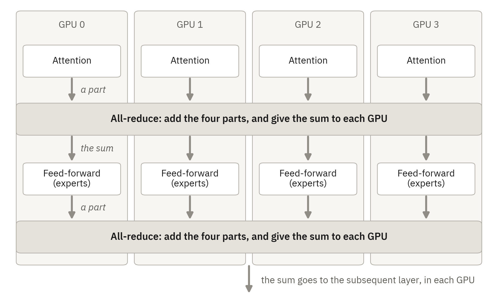

*Figure 9. The work for one layer of the model. The white boxes are work in each GPU, and the gray bars are work
between the GPUs. In each part of the layer, each GPU calculates a partial result. Then an all-reduce adds the four
partial results and gives the sum to each GPU. The diagram is a simplification: a layer has more steps than these,
and some steps do the same work on each GPU.*

**1. Work in each GPU.** The two parts of a layer do different work.

- **Attention.** The attention part uses the earlier tokens of the request. This model has two types of attention.
  11 of the 45 layers have a sparse attention: the layer first selects some of the earlier tokens, and then it
  reads only these tokens. The other 34 layers have a linear attention: the layer keeps a summary of the earlier
  tokens and changes it for each new token.
- **Feed-forward.** In 42 of the 45 layers, this part is a group of experts. An expert is a small part of the
  model. A layer has 288 routed experts and 1 shared expert. For each token, the model uses 8 of the routed experts
  and the shared expert. In these layers, the weights of the routed experts are 4-bit numbers in the NVFP4 format.
  The first 3 layers have a dense part and no experts.

**2. Work between the GPUs.** After each of the two parts, each GPU has only a partial result. An all-reduce adds
the four partial results and gives the sum to each GPU. On our host, the data of an all-reduce goes through the
PCIe slots (Appendix A.5).

The table shows the source of the kernels on the two vLLM inference stacks in our tests.

| Part of the model | Jovian Judgement r24 | Official vLLM 0.31.0 |
|---|---|---|
| Sparse attention: the selection of the earlier tokens | B12X | DeepGEMM for the scores, a CUDA kernel of vLLM for the selection, and Triton kernels |
| Sparse attention: the attention on the selected tokens | B12X | FlashInfer |
| Linear attention in decode | B12X | A Triton kernel |
| Linear attention in prefill | FlashKDA | FlashKDA |
| Routed experts with 4-bit weights | B12X | FlashInfer CUTLASS |
| Experts of the draft head | Marlin | Marlin |
| All-reduce between the four GPUs | The PCIe all-reduce of B12X. NCCL does the messages that B12X does not accept. | NCCL. The tuned configuration also uses a FlashInfer PCIe all-reduce for a maximum of 256 tokens. |

The draft head is the small part of the model that proposes the draft tokens (the MTP head). Its experts have 8-bit
weights.

### G.3 Three ideas that can make a kernel faster

The source code of B12X shows three ideas. Each idea is a possible cause of the speed of Jovian Judgement. We did
not measure the effect of each idea.

**Idea 1: one kernel for a group of steps.** Each kernel has a start cost. Each kernel also writes its result into
GPU memory, and the subsequent kernel reads it again. One kernel for a group of steps starts one time. It can also
write and read less data.

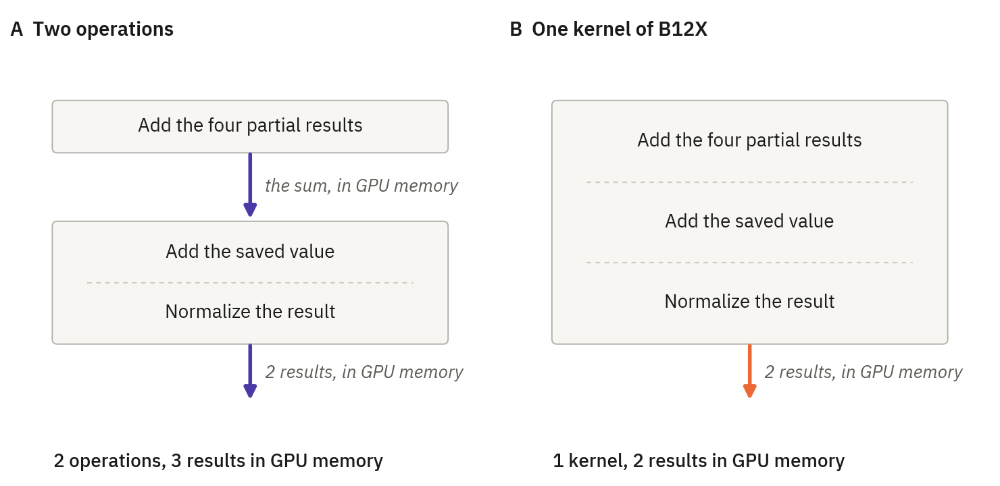

*Figure 10. Three steps of the draft head: the all-reduce, the addition of a saved value, and the normalization.
Panel A shows the three steps as two operations. Panel B shows the one kernel of B12X that does the three steps.
The two results are the new saved value and the normalized result. The server can use this kernel only for a small
message (Figure 11).*

- **The all-reduce.** B12X has one kernel that adds the four partial results, adds a saved value, and normalizes
  the result (Figure 10). The saved value is the state of the model from before the job. In this model, this
  sequence of steps is in the draft head. The start log of Jovian Judgement shows that the setting for this
  sequence is on (`fuse_allreduce_rms: True`). The start logs of the official vLLM show that it is off. We did not
  count how many times Jovian Judgement used the kernel.
- **The main layers.** The 45 layers of the main model have a different sequence of steps after a job. They keep
  four versions of their state. B12X has one kernel for a group of these steps also.
- **The experts.** An expert has two multiplications and one step between them. B12X has one kernel for the three
  operations.
- **The selection of tokens.** The sparse attention gives a score to each group of 4 earlier tokens. For a small
  step that obeys its conditions, one kernel of B12X calculates the scores and selects groups with high scores. It
  does not write the score of each group into memory. A different step then finds the tokens of these groups.

**Idea 2: a method for each size of data.** A small decode step moves a small quantity of data between the GPUs,
and a large prefill step moves a large quantity. One method is not the best for the two cases. The PCIe all-reduce
of B12X has three methods. The size and the layout of the message select the method. NCCL does each message that
the three methods do not accept. NCCL is the general library of NVIDIA for transfers between GPUs.

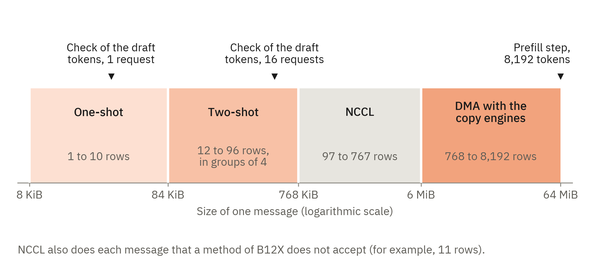

*Figure 11. The method of the all-reduce of Jovian Judgement r24 for each message size. The limits in bytes are
from the start log. The numbers of rows and the three examples are a calculation from the source code (see the text
below the table).*

| Method | Size of one message | Rows in the message | Example of a step |
|---|---|---|---|
| One-shot | 84 KiB or less | 1 to 10 | The check of the draft tokens for 1 or 2 requests |
| Two-shot | More than 84 KiB, to 768 KiB | 12 to 96, in groups of 4 | The check of the draft tokens for 3 to 24 requests |
| DMA with the copy engines | 6 MiB to 64 MiB | 768 to 8,192 | A prefill step with 8,192 tokens |
| NCCL | Each other size | 97 to 767. Also 11 to 95, if the number is not a multiple of 4. | A prefill step with 500 tokens |

- **One-shot.** Each GPU reads the partial results of the other three GPUs directly and adds them. The kernel of
  Figure 10 operates in this range only.
- **Two-shot.** The GPUs divide the message into four pieces. Each GPU reads the values for one piece from the
  other GPUs and adds them. Then each GPU reads the three other completed pieces. This method accepts only a number
  of rows that is a multiple of 4.
- **DMA with the copy engines.** A GPU has hardware that only copies data. This method uses that hardware to move a
  large message between the four GPUs, and a kernel adds the data. The server keeps memory for a message of 64 MiB.
- **NCCL.** NCCL does the sizes between the two-shot limit and the DMA limit. It also does a message with a layout
  that the methods of B12X do not accept. An example is a message of 11 rows.

The lower limits in bytes are from the start log. The limit of 64 MiB, the numbers of rows, and the examples are a
calculation from the source code. The calculation assumes a message with one row for each token of a step. A row
has 4,096 values of 2 bytes, which is 8 KiB. Thus a message of 84 KiB or less has a maximum of 10 full rows. The
largest step of our settings has 8,192 tokens, and thus the largest message has 64 MiB.

The examples for decode are for the check of the draft tokens. In this step, the main model examines 4 tokens for
each request: 1 token and its 3 draft tokens. Thus the message has 4 rows for each request. The later steps of
the draft head are smaller: they can have 1 row for each request. The server can also add empty rows to a step, to
get a size that it prepared at its start. We did not count the method of each step in our tests.

The kernels for the experts use the same idea. They have one form for a small number of rows and one form for many
rows.

**Idea 3: kernels for one GPU family and for the sizes of the model.** B12X makes its kernels for one GPU family.
It compiles a kernel at the first use, for the number formats and the sizes of this model. The server uses the
kernels during its start, and thus the first start is longer. B12X also has kernels for other models. The other
libraries also select special kernels for a GPU type.

The other libraries use some of the same ideas. For example, FlashInfer also has kernels for the 4-bit weights and
for the sparse attention on this GPU family. Thus the ideas of this section do not show that B12X is faster. Only
a test can show it.

### G.4 What our tests show

Jovian Judgement and the official vLLM use the same weights on the same host. Thus these tests compare the software
of the two inference stacks. The variation between runs also changes a measured difference (Appendix B.6). The table shows
three tests.

| Test | Jovian Judgement r24 | Official vLLM, default | Official vLLM, tuned |
|---|---:|---:|---:|
| Prefill of a cold prompt of 64K tokens, tokens/s | 11,141 | 7,079 | 6,741 |
| 56K context, thinking on, top_p 0.95, top_k 20, 16 requests, tokens/s | 1,123 | 841 | 978 |
| Short greedy answers (prose), 16 requests, tokens/s | 1,105 | 866 | 958 |

The row for the 56K context shows the mean of two runs for each inference stack. The other two rows show one run for each
inference stack. For the official vLLM, these two rows show the second of its two runs.

- **Jovian Judgement was faster than the official vLLM in these three tests.** Sections 2, 3, and 4 give the
  conditions.
- **The work between the GPUs is important for prefill on our host.** One test changed the direct GPU links of
  Jovian Judgement (section 6). That test used 8 slots, and the table above is for 16 slots. With the links off,
  the prefill speed was 6,718 to 7,090 tokens/s. With the links on, it was 10,173 to 11,299 tokens/s. With the
  links off, the speed was near to the speed of the official vLLM.
- **That test does not show the effect of B12X alone.** It changed two settings together: the PCIe all-reduce of
  B12X and the direct transfers of NCCL (Appendix C.7).
- **B12X does not make an inference stack the fastest for each load.** TensorFold does not use B12X. For one greedy code
  request, TensorFold was 35% faster than Jovian Judgement (section 2).
- **The two vLLM inference stacks are different in more than the kernels.** The scheduler, the draft tokens, and the cache
  are also different (Appendix E.1). Our tests compare complete inference stacks.

### G.5 The costs

| Cost | What it means |
|---|---|
| One GPU family | B12X operates only on GPUs with the architecture names SM120 and SM121. |
| The direct GPU links are necessary | The PCIe all-reduce moves data directly between the GPUs. On our host, the IOMMU prevented direct writes between the GPUs. TensorFold then stopped during its start, with no error message (Appendix A.5). One month before, Jovian Judgement stopped with the same symptoms. The IOMMU is a possible cause of that earlier stop. |
| Results that are not always the same bit for bit | Two methods can add the numbers in a different sequence, and they can round them at different points. Thus their results can be different. A small difference can change a sampled reply. Only a test can show the size and the effect of the differences. In our quality run through the pi agent, we found no difference in task accuracy between Jovian Judgement and the official vLLM (section 7). |
| A longer first start | B12X compiles a kernel at the first use. Then it keeps the result for the subsequent starts. |
| GPU memory | B12X keeps work areas in GPU memory. It keeps its plans in the memory of the host, and a plan can refer to a work area. With the same memory fraction and 16 slots, the KV cache had 2.68M tokens on Jovian Judgement and 3.38M tokens on the official vLLM in its default configuration. We did not find how much of this difference comes from B12X. |
| Less support | The authors of B12X write that it is not for production in a data center. For such use, they give the names of three other libraries: FlashInfer, CUTLASS, and TRTLLM. The package changes quickly, and it needs one exact version of its compiler. |

### G.6 When B12X is a good selection

This section is our opinion. It comes from the source code and from the tests of this paper. B12X is a good
selection if these four conditions are true:

1. The GPUs are in the family that B12X supports.
2. The direct GPU links operate. Do the copy test of Appendix A.5 before you start the server.
3. A test with your own requests shows an advantage.
4. You can use a package that changes quickly.

If one of these conditions is not true, use the official vLLM. Its kernels operate on more GPU types.

## License

The scripts, the probes, the data, and the text in this repository have the MIT license. Refer to
[`LICENSE`](LICENSE). The recipes, the engines, and the model weights have their own licenses.

- [`patches/tensorfold-modified-engine.patch`](patches/tensorfold-modified-engine.patch) is a change to TensorFold. It has
  the Apache License 2.0 of TensorFold.
- The task prompts in `quality/datasets/` come from HumanEval (MIT license) and MBPP (CC BY 4.0), through EvalPlus
  (Apache License 2.0).
- The font files in `scripts/fonts/` are IBM Plex Sans. They have the SIL Open Font License 1.1
  ([`scripts/fonts/OFL.txt`](scripts/fonts/OFL.txt)). The figures use this font.

## About the text

The text of this paper obeys the rules of ASD-STE100 Simplified Technical English where possible.
`scripts/ste_check.py` counts the sentences that obey the rules that a script can examine. The script does not
contain the STE dictionary, and thus it cannot examine each word.
